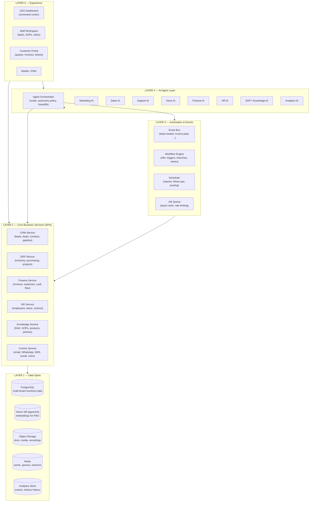
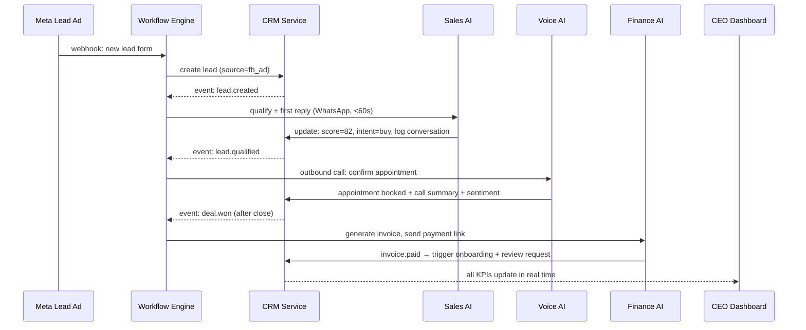

# 1. System Architecture

## 1.1 Architecture at a Glance

The AI-BOS is built as **five layers**. Each layer only talks to the layer
below it through defined APIs, so any component can be upgraded without
rebuilding the system.

## 1.2 How Departments Communicate (No Silos)

Everything is glued together by **two shared mechanisms**:

1. **The data spine (Layer 1–2).** There is exactly one record for a customer,
   one for a deal, one for an invoice. Marketing AI and Sales AI read and
   write the *same* lead record via the CRM API.
2. **The event bus (Layer 3).** When any service changes state, it publishes
   an event. Other departments react by subscription, never by being called
   directly.

Example — a Facebook ad lead flowing through five departments with zero
human touches:

## 1.3 Component Map by Department

| Requested department | Where it lives in the architecture |
|---|---|
| 1. CEO Dashboard | Layer 5 app reading Layer 2 APIs + analytics store; Analytics AI generates insights |
| 2. Marketing AI | Agent (L4) + content tables (L2 CRM/CMS) + scheduler (L3) |
| 3. Branding AI | Agent (L4) writing to Knowledge Service brand-kit collection |
| 4. Content Creation AI | Agent (L4) + media pipeline (image/voice/video gen APIs) + object storage |
| 5. Social Media AI | Comms Service adapters (Meta, TikTok, LinkedIn, YouTube, Google Business) + engagement agent |
| 6. AI Sales Team | Sales agent (L4) + CRM pipeline (L2) + lead-scoring job (L3) |
| 7. AI Customer Support | Support agent (L4) + ticketing tables (L2) + CSAT surveys (L3) |
| 8. AI Voice Calling | Voice platform adapter (Comms Service) + Voice agent config (L4) |
| 9. CRM | Core service (L2) — build thin, own the data |
| 10. ERP | Core service (L2) — integrate open-source ERP, don't rebuild |
| 11. HR AI | HR agent (L4) + HR service (L2) |
| 12. SOP AI | SOP agent (L4) + Knowledge Service (L2) with step-by-step guide mode |
| 13. Knowledge Base AI | Knowledge Service (L2): RAG over tenant documents only |
| 14. Finance AI | Finance agent (L4) + Finance service (L2) + accounting integration |
| 15. Executive Analytics | Analytics store (L1) + Analytics agent (L4) + report scheduler (L3) |
| 16. Workflow Automation | Workflow engine + event bus (L3) |
| 17. Integrations | Adapter pattern in Comms/Finance services — see [doc 9](09-integrations.md) |
| 18. Security | Cross-cutting: RBAC, audit log, encryption — see [doc 8](08-security.md) |
| 19. Documentation | This doc set + generated user guides |

## 1.4 The Agent Orchestrator (the "AI Manager")

The orchestrator is the single entry point for all AI work. It:

- **Routes** each incoming task (message, event, scheduled job) to the right
  department agent based on channel, intent, and tenant config.
- **Enforces autonomy policy** per agent per tenant:
  `draft` (human sends) → `approve` (human clicks OK) → `auto` (agent acts,
  human audits). Every tenant starts at `draft`/`approve` and graduates.
- **Manages handoffs**: Sales AI → human closer, Support AI → human agent,
  any agent → another agent (with conversation context attached).
- **Loads context**: tenant brand voice, relevant SOPs (via RAG), customer
  timeline from CRM, conversation memory.
- **Logs everything**: every prompt, response, tool call, token cost, and
  outcome goes to the audit trail — this powers the "AI Agent Status" tile
  on the CEO dashboard and per-agent ROI reporting.

## 1.5 Multi-Tenancy (Sell-to-SME Readiness)

- **Row-level isolation**: every table carries `tenant_id`; PostgreSQL
  row-level security guarantees tenant A can never read tenant B's data.
- **Tenant config bundle**: brand kit, agent prompts/autonomy levels, enabled
  modules, connected integrations, pricing plan. Onboarding a new SME =
  creating a bundle + connecting their accounts + uploading their documents.
- **Module flags**: an SME can buy CRM + Sales AI + Support AI only, and add
  ERP or HR later — the architecture doesn't care.
- **White-label**: the dashboard reads logo/colors/domain from tenant config.

## 1.6 Why This Approach Is the Right One

1. **The moat is the orchestration, not the parts.** LLMs, telephony,
   accounting are commodities. The sellable asset is the integrated agent
   layer + prompt library + workflow library + dashboard, which this design
   isolates cleanly so it compounds in value.
2. **Event-driven beats point-to-point.** With 19 departments, direct
   integrations would mean ~170 connection pairs. One event bus means each
   component connects once.
3. **Buy/build split controls cost and time.** Building a full ERP or PBX
   from scratch would burn 12+ months before any AI value ships. Integrating
   proven components ships Phase 1 in weeks.
4. **Autonomy dial makes it trustworthy.** "AI runs 80–95% of the business"
   is achieved gradually and safely — measured, not promised.
5. **Modular = upgradeable.** Model providers, voice vendors, and social APIs
   change fast. Adapters and agent config bundles mean swapping a vendor is
   a config change, not a rebuild.
