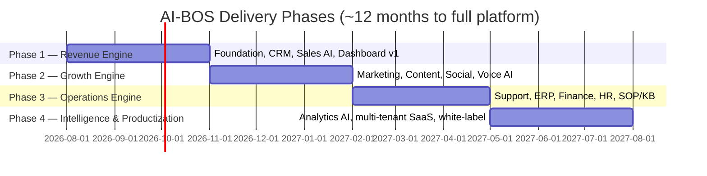

# 2. Implementation Roadmap

## 2.1 Strategy

Ship value in the order money flows: **capture leads → close sales → serve
customers → run the back office → predict the business.** Each phase ends
with something a real company uses daily, so the system pays for itself while
it is being built.

## 2.2 Phase 1 — Revenue Engine (Months 1–3)

**Goal: no lead is ever missed, and the CEO sees the business in one screen.**

| Workstream | Deliverables |
|---|---|
| Foundation | Multi-tenant PostgreSQL + pgvector, auth/RBAC, event bus, audit logging, CI/CD, environments |
| CRM core | Leads, contacts, pipeline, deals, tasks, appointments, notes, timeline, documents |
| Sales AI v1 | Instant reply (WhatsApp + web chat + email), qualification, lead scoring, objection handling, appointment booking, human handoff, follow-up sequences |
| Knowledge v1 | Document upload → RAG; agents answer only from tenant knowledge |
| Automations v1 | Lead-to-appointment workflow, reminders, no-show recovery, cold-lead re-engagement |
| CEO Dashboard v1 | Daily sales/revenue, leads, conversion rate, pipeline value, pending tasks, appointments, AI agent status |
| Integrations v1 | WhatsApp Business API, Google/Outlook Calendar, email, Stripe/payment link, Meta lead ads |

**Exit criteria:** a live business runs its whole lead-to-appointment flow
through the system for 2+ weeks; response time < 60s; dashboard numbers match
reality.

## 2.3 Phase 2 — Growth Engine (Months 4–6)

**Goal: marketing output of a 5-person team from one approval queue.**

| Workstream | Deliverables |
|---|---|
| Marketing AI | Marketing plans, campaign ideas, monthly content calendar, personas, competitor & trend analysis, A/B ideas, campaign reports |
| Branding AI | Brand strategy, voice, guidelines, mission/vision, story, value proposition, positioning, naming — saved as the tenant Brand Kit that all other agents obey |
| Content AI | Posts for FB/IG/TikTok/LinkedIn, blogs/SEO, email campaigns, WhatsApp broadcasts, ad copy/headlines, landing pages, video hooks & scripts, hashtags, CTAs; AI images + AI voiceover; long-video → shorts repurposing plan |
| Social Media AI | Multi-platform scheduling/publishing, comment & DM replies, engagement reports, social listening, competitor monitoring |
| Voice AI | Inbound + outbound calls: appointment confirmation, lead qualification, missed-call callback, follow-ups; recordings, transcripts, summaries, sentiment |
| Dashboard v2 | Marketing performance, content pipeline, call analytics, channel ROI |

**Exit criteria:** 30 days of content generated/scheduled from one calendar;
voice agent completes real confirmation calls with >90% correct outcomes.

## 2.4 Phase 3 — Operations Engine (Months 7–9)

**Goal: the back office runs itself.**

| Workstream | Deliverables |
|---|---|
| Support AI | 24/7 FAQ handling, ticketing, escalation rules, post-resolution follow-up, CSAT surveys, full customer history |
| ERP | Inventory, purchasing, suppliers, projects — via ERPNext/Odoo integration with our API layer |
| Finance AI | Invoicing, expenses, revenue, cash-flow tracking, budget vs actual, monthly P&L narrative reports, accounting-software sync |
| HR AI | Job posts, resume screening, interview scheduling, onboarding checklists, leave management, performance review drafts, payroll-system integration |
| SOP AI | SOP generator (interviews the process owner → writes the SOP), step-by-step guide mode, staff Q&A over company docs |
| Automations v2 | Quote → invoice → payment → onboarding → review request → retention campaign (full lead-to-cash loop) |

**Exit criteria:** invoice-to-payment untouched by humans in the happy path;
staff questions answered from SOPs with cited sources; monthly finance pack
auto-generated.

## 2.5 Phase 4 — Intelligence & Productization (Months 10–12)

**Goal: predictive command center + a product you can sell.**

| Workstream | Deliverables |
|---|---|
| Executive Analytics | Business Health Score, daily/weekly/monthly/quarterly/annual report packs, forecasting (revenue, cash, pipeline), risk alerts, growth recommendations, customer satisfaction trends, staff & agent performance |
| SaaS hardening | Self-serve tenant onboarding wizard, billing/subscription plans, module flags, usage metering (AI cost per tenant), white-label theming |
| Security & compliance | Pen-test, backup/restore drills, data-retention policies, DPA templates, SOC2-track controls |
| Documentation & training | Admin guide, user manual, training curriculum + videos, industry template packs (agency, clinic, retail, services) |

**Exit criteria:** a second company (pilot SME) onboarded in < 1 week without
code changes.

## 2.6 Estimated Timeline Summary

| Phase | Duration | Cumulative |
|---|---|---|
| Phase 1 — Revenue Engine | 12 weeks | Month 3 |
| Phase 2 — Growth Engine | 12 weeks | Month 6 |
| Phase 3 — Operations Engine | 12 weeks | Month 9 |
| Phase 4 — Intelligence & Productization | 12 weeks | Month 12 |

A solo senior builder stretches this ~1.5–2×; a 3–4 person team (1 architect/
full-stack lead, 1 backend, 1 automation/AI engineer, 1 part-time
designer/QA) hits it comfortably.

## 2.7 Estimated Cost

Two honest scenarios (all figures USD):

**A) Lean build (solo expert + SaaS glue)** — good for running *your own*
companies fast; weaker as a sellable product because the stack is rented.

| Item | Cost |
|---|---|
| Build effort (freelance senior, ~9–12 months part-scope) | $30k–60k |
| SaaS tools (automation platform, voice, social scheduler, hosting) | $500–1,500/mo |
| LLM + voice usage | $200–1,000/mo per business (scales with volume) |

**B) Product build (small team, own the platform)** — matches this
architecture; this is what you sell to SMEs.

| Item | Cost |
|---|---|
| Team build (3–4 people × 12 months, blended) | $150k–350k (region-dependent; SEA/EE rates at the low end) |
| Infrastructure (cloud, DB, storage, monitoring) | $300–1,000/mo growing with tenants |
| LLM + voice + messaging usage | $0.05–0.50 per conversation; ~$150–800/mo per active tenant |
| Third-party licenses (WhatsApp BSP, voice minutes, social APIs) | $100–500/mo per tenant footprint |

Rule of thumb for the SaaS business case: target tenant pricing at
**3–5× your per-tenant infra + AI cost**, e.g. $500–2,000/mo per SME
depending on modules — Phase 1–3 scope supports that price point.

## 2.8 Future Scalability

- **Tenants:** row-level-security Postgres comfortably serves hundreds of SME
  tenants; shard or move big tenants to dedicated DBs later without app changes.
- **AI load:** all agent calls go through the orchestrator, so adding caching,
  cheaper models for simple tasks, and batch processing is a config change.
- **New departments:** an agent is a config bundle (prompt + tools + knowledge
  scope). Legal AI or Procurement AI is added without touching existing code.
- **New channels/vendors:** adapter pattern — Telegram, WeChat, a new voice
  vendor, or a new LLM provider each cost one adapter, not a rewrite.
- **Industry packs:** tenant templates (clinic pack, agency pack, retail pack)
  bundle prompts + workflows + SOP starters per vertical — this is how the
  product replicates across industries.
