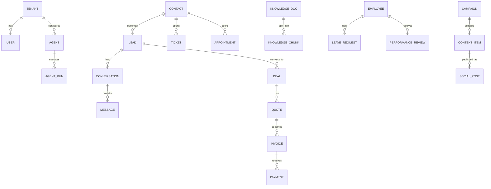

# 4. Database Design

PostgreSQL, multi-tenant via `tenant_id` on every row + Row-Level Security.
`pgvector` lives in the same database for knowledge embeddings. Time-series
KPI history sits in regular tables first (partitioned later if needed).

Conventions: `id UUID PK`, `tenant_id UUID NOT NULL`, `created_at/updated_at
timestamptz`, soft deletes via `deleted_at`. All FKs implicitly include
tenant scope.

## 4.1 Entity Overview



## 4.2 Core Tables

### Platform & security

| Table | Key columns | Purpose |
|---|---|---|
| `tenants` | name, plan, modules jsonb, brand_kit jsonb, settings jsonb | One row per company on the platform |
| `users` | tenant_id, email, role, mfa_enabled | Staff logins |
| `roles` / `permissions` | role → permission mapping (RBAC) | ceo, manager, sales, support, finance, hr, readonly |
| `api_keys` | tenant_id, scopes, hashed_key, expires_at | Secure external API access |
| `audit_log` | tenant_id, actor_type (user/agent/system), actor_id, action, entity, entity_id, before jsonb, after jsonb, ip | Every state change, human or AI |
| `integration_connections` | tenant_id, provider, credentials (encrypted), status, scopes | WhatsApp, Meta, QuickBooks, calendars... |

### CRM & sales

| Table | Key columns | Purpose |
|---|---|---|
| `contacts` | name, phones jsonb, emails jsonb, company, tags, consent flags | The single customer record |
| `leads` | contact_id, source, channel, score int, score_reasons jsonb, stage, owner (user or agent), assigned_at | Pipeline entries; `score` maintained by Sales AI |
| `deals` | lead_id, value, currency, stage, probability, expected_close, won_lost_reason | Sales pipeline |
| `pipelines` / `pipeline_stages` | per-tenant configurable stages | Custom sales processes |
| `activities` | entity_type/id, kind (call/email/meeting/note/task), due_at, done_at, actor | Unified timeline & tasks/reminders |
| `appointments` | contact_id, staff_id, starts_at, status, reminder_state, source (voice/chat/manual) | Booking system, calendar-synced |
| `quotes` | deal_id, line_items jsonb, total, status, valid_until, pdf_url | AI-generated quotations |
| `conversations` | contact_id, channel (whatsapp/email/webchat/voice/instagram...), status, assigned_to (agent/human), csat | One thread per channel per contact |
| `messages` | conversation_id, direction, sender_type, body, media jsonb, intent, sentiment | Full history — feeds agent memory |

### Support

| Table | Key columns |
|---|---|
| `tickets` | contact_id, conversation_id, priority, category, status, sla_due_at, escalated_to, resolution |
| `csat_responses` | ticket_id, score, comment |

### Finance & ERP-side

| Table | Key columns |
|---|---|
| `invoices` | contact_id, deal_id, line_items jsonb, total, tax, status, due_at, external_ref (QuickBooks/Xero id) |
| `payments` | invoice_id, amount, method, provider_ref, paid_at |
| `expenses` | category, vendor, amount, receipt_url, approved_by, recurring |
| `budgets` | period, category, planned, actual (view) |
| `cashflow_snapshots` | date, cash_in, cash_out, balance, runway_days |
| `products` | sku, name, price, cost, stock_qty (or ERPNext ref), description — also feeds RAG |

Inventory/purchasing/suppliers/projects live in **ERPNext**; we store
`external_ref` links and sync summaries needed for dashboards.

### HR

| Table | Key columns |
|---|---|
| `employees` | user_id, position, department, hired_at, salary_band, payroll_ref |
| `candidates` | role_id, resume_url, screening_score, screening_notes jsonb, stage |
| `job_roles` | title, description, requirements |
| `leave_requests` | employee_id, type, from/to, status, approved_by |
| `performance_reviews` | employee_id, period, kpis jsonb, ai_draft, final_text, rating |
| `onboarding_tasks` | employee_id, template_id, step, status |

### Knowledge & SOPs (RAG)

| Table | Key columns |
|---|---|
| `knowledge_docs` | title, kind (sop/policy/product/script/faq/training), source_url, version, access_roles, status |
| `knowledge_chunks` | doc_id, chunk_text, embedding vector(1536), metadata jsonb |
| `sops` | doc_id, department, steps jsonb (ordered, with role + tool per step), owner, review_due_at |

RAG queries are **always filtered by `tenant_id` + `access_roles`** before
similarity search — knowledge isolation is enforced in SQL, not in the prompt.

### Marketing & content

| Table | Key columns |
|---|---|
| `campaigns` | name, objective, channels, budget, start/end, status, results jsonb |
| `content_items` | campaign_id, type (post/blog/email/script/ad/image/video), platform, title, body, media_url, status (draft/approved/scheduled/published), scheduled_at |
| `social_posts` | content_item_id, platform, external_id, published_at, metrics jsonb (likes/comments/shares/reach, refreshed on schedule) |
| `personas` | name, demographics jsonb, pains, goals, objections, channels |
| `brand_kits` | (in tenants.brand_kit) voice, tone rules, banned words, colors, logo refs, mission, vision, story, value_prop |

### AI agent layer

| Table | Key columns |
|---|---|
| `agents` | tenant_id, department, name, system_prompt_ref, model_policy jsonb, tools jsonb, knowledge_scope jsonb, autonomy (draft/approve/auto), active |
| `agent_runs` | agent_id, trigger (event/message/schedule), input_ref, output_ref, tool_calls jsonb, tokens_in/out, cost, latency_ms, outcome (success/handoff/error), human_feedback |
| `approval_queue` | agent_run_id, payload (what the agent wants to send/do), status (pending/approved/rejected/edited), reviewed_by |
| `voice_calls` | contact_id, direction, duration, recording_url, transcript, summary, sentiment, outcome, cost |

### Analytics

| Table | Key columns |
|---|---|
| `events` | tenant_id, name (lead.created, invoice.paid...), entity, entity_id, payload jsonb, occurred_at — partitioned by month |
| `kpi_daily` | tenant_id, date, metric, value — materialized nightly from events + core tables; powers every dashboard chart and the Business Health Score |
| `reports` | period_type (daily/weekly/monthly/quarterly/annual), period, data jsonb, ai_narrative, pdf_url, sent_to |
| `health_scores` | date, overall, components jsonb (sales, cash, marketing, service, team), risks jsonb, recommendations jsonb |

## 4.3 The Event Catalog (how tables drive automation)

Every workflow in [doc 6](06-workflows.md) subscribes to rows landing in
`events`. Canonical names:

```
lead.created        lead.qualified       lead.gone_cold
appointment.booked  appointment.no_show  deal.stage_changed
deal.won            deal.lost            quote.sent
invoice.created     invoice.paid         invoice.overdue
ticket.opened       ticket.escalated     ticket.resolved
csat.received       call.completed       content.approved
content.published   employee.hired       leave.requested
kpi.threshold_breached                   agent.handoff_requested
```

Adding a department later = adding events + subscribers. No schema surgery.
