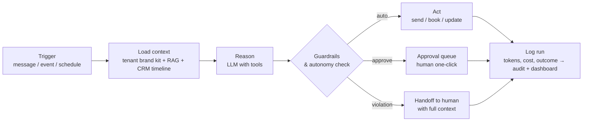

# 5. AI Agent Architecture

## 5.1 The Agent Pattern (every AI employee is built the same way)

An agent is **configuration, not code**:

```yaml
agent:
  name: sales_ai
  department: sales
  model_policy:            # router picks per task class
    conversation: frontier
    classification: small
  system_prompt: prompts/sales/system.md     # from the Prompt Library
  knowledge_scope: [products, sales_scripts, pricing, faqs]  # RAG filters
  tools:
    - crm.get_contact_timeline
    - crm.update_lead
    - crm.create_appointment
    - comms.send_message          # gated by autonomy level
    - quotes.generate
    - handoff.to_human
  autonomy: approve               # draft | approve | auto (per tenant)
  guardrails:
    max_discount_pct: 10
    forbidden_topics: [legal advice, competitor pricing claims]
    escalate_when: [angry_customer, refund_request, deal_value > 10000]
  memory:
    short_term: conversation thread
    long_term: contact timeline + agent_runs history
```

Every agent execution follows one loop:



This uniformity is what makes the system sellable: new department = new
config bundle; new tenant = same bundles with different knowledge and brand.

## 5.2 The Orchestrator

- **Intent router:** classifies every inbound item (channel + content) →
  department agent. Cheap model, <300ms.
- **Handoff protocol:** agents hand off to humans or to each other with a
  structured packet: `{contact, conversation summary, intent, sentiment,
  attempted actions, recommended next step}`. Nothing restarts from zero.
- **Autonomy policy engine:** enforces draft/approve/auto per agent per
  tenant, plus hard rules (e.g. payments and payroll are *never* `auto`).
- **Cost governor:** per-tenant monthly AI budget; degrades to cheaper models
  or queues low-priority work when the cap nears.

## 5.3 Department Agent Specs

| Agent | Triggers | Key tools | Outputs | Default autonomy |
|---|---|---|---|---|
| **Sales AI** | inbound message, lead.created, follow-up schedule, lead.gone_cold | CRM read/write, send message, book appointment, generate quote, handoff | instant replies (<60s), qualification, lead score + reasons, booked meetings, quotes, follow-up sequences, buying-signal alerts | approve → auto |
| **Voice AI** | appointment.booked (confirm), missed call, outbound campaign list | voice platform (call, transfer), CRM write, calendar | completed calls, recordings, transcripts, summaries, sentiment, booked/confirmed slots | approve scripts, auto dial |
| **Support AI** | inbound support message, ticket.opened, ticket SLA timer | KB search, ticket CRUD, send message, escalate, CSAT survey | resolved FAQs, tickets with clean histories, escalation packets, CSAT collection | auto for FAQs, escalate rest |
| **Marketing AI** | monthly planning cron, campaign brief, campaign end | KB (brand kit, personas), web research, content_items CRUD, analytics read | marketing plans, calendars, campaign ideas, personas, competitor/trend briefs, A/B ideas, campaign reports | draft |
| **Branding AI** | onboarding wizard, brand review request | KB write (brand kit), web research | brand strategy, voice & guidelines, mission/vision/story, value prop, positioning, naming options | draft |
| **Content AI** | content calendar slots, repurpose request | brand kit + personas (RAG), image gen, TTS voice, content_items CRUD | platform-native posts, blogs/SEO, emails, broadcasts, ad copy, scripts & hooks, captions, hashtags, images, voiceovers, shorts plans, thumbnails | draft → approve |
| **Social Media AI** | schedule, new comment/DM webhook, listening cron | platform adapters (publish, reply, metrics), sentiment | published posts, comment/DM replies, engagement reports, social listening & competitor digests | approve replies, auto publish approved content |
| **Finance AI** | invoice events, month-end cron, budget thresholds | invoices/expenses CRUD, accounting sync, payment links, report writer | invoices & payment chasing, expense categorization, cash-flow & P&L narratives, budget alerts, forecasts | approve (money never auto) |
| **HR AI** | new application, interview scheduling, review period, leave.requested | candidate CRUD, calendar, KB (policies), payroll sync read | screened & scored resumes, scheduled interviews, onboarding checklists, review drafts, leave handling, policy answers | approve |
| **SOP AI** | "document this process" request, staff question, SOP review_due | KB read/write, step-guide renderer | new/updated SOPs, step-by-step guidance sessions, cited answers to staff questions | auto for answers, draft for SOPs |
| **Analytics AI** | daily/weekly/monthly crons, kpi.threshold_breached | kpi_daily read, events read, report writer, notifier | daily KPI digest, weekly/monthly/quarterly/annual packs, Business Health Score, forecasts, risk alerts, growth recommendations | auto (read-only) |

## 5.4 Memory & Knowledge Design

- **Short-term:** the conversation thread (windowed + summarized when long).
- **Customer memory:** the CRM timeline is the memory — every message, call
  summary, ticket, and payment is queryable by any agent. This is why the
  data spine matters more than any prompt.
- **Company knowledge (RAG):** `knowledge_chunks` filtered by tenant + agent
  `knowledge_scope` + user role, then similarity-ranked, then re-ranked.
  Agents must cite doc titles; "answer only from company knowledge" is
  enforced by prompt + a groundedness check on the output for KB answers.
- **Agent self-memory:** `agent_runs` + human feedback (edits in the approval
  queue are gold) feed weekly prompt-tuning reviews — the improvement loop.

## 5.5 Quality & Safety Controls

1. **Approval queue** as the default release valve for anything outward-facing.
2. **Guardrail checks** (deterministic, not LLM): discount caps, forbidden
   topics, spend limits, PII redaction in logs.
3. **Evals before autonomy upgrades:** replay a golden set of real
   conversations/tasks against a new prompt/model; promote only on
   equal-or-better scores.
4. **Kill switch per agent** on the CEO dashboard.
5. **Full traceability:** every output links to its run (prompt, context
   docs, tool calls, cost) in the audit trail.
