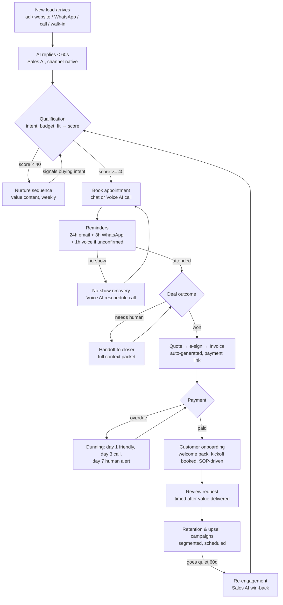
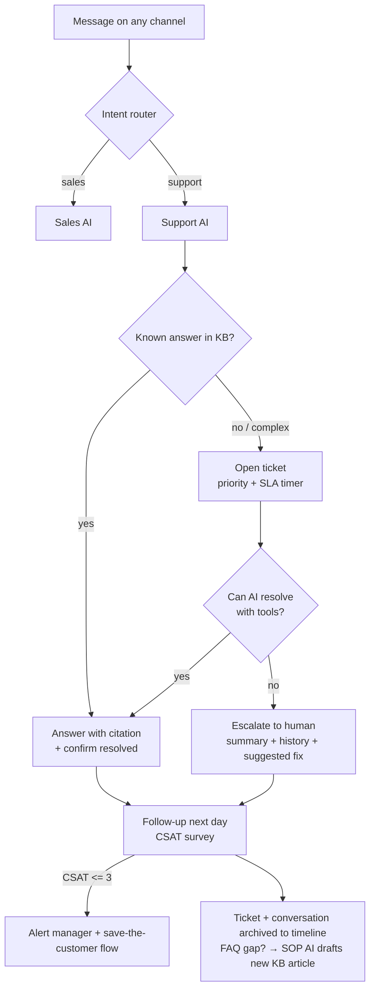
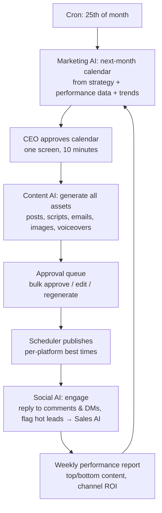
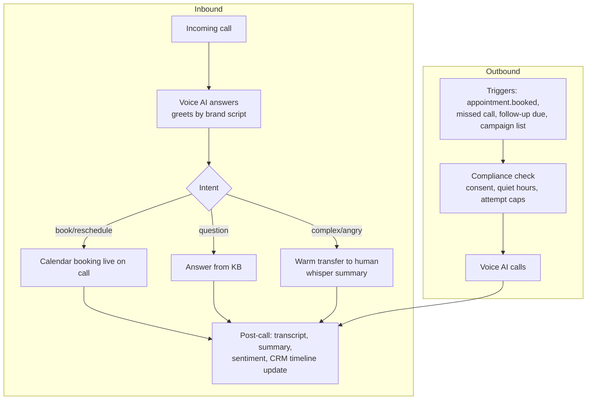
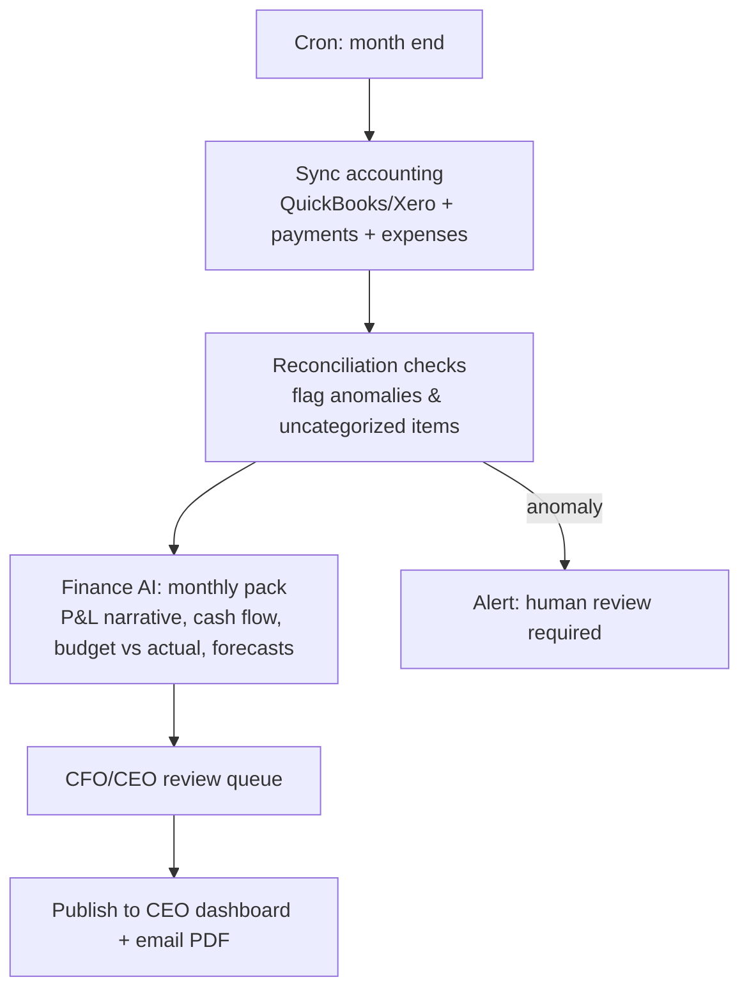
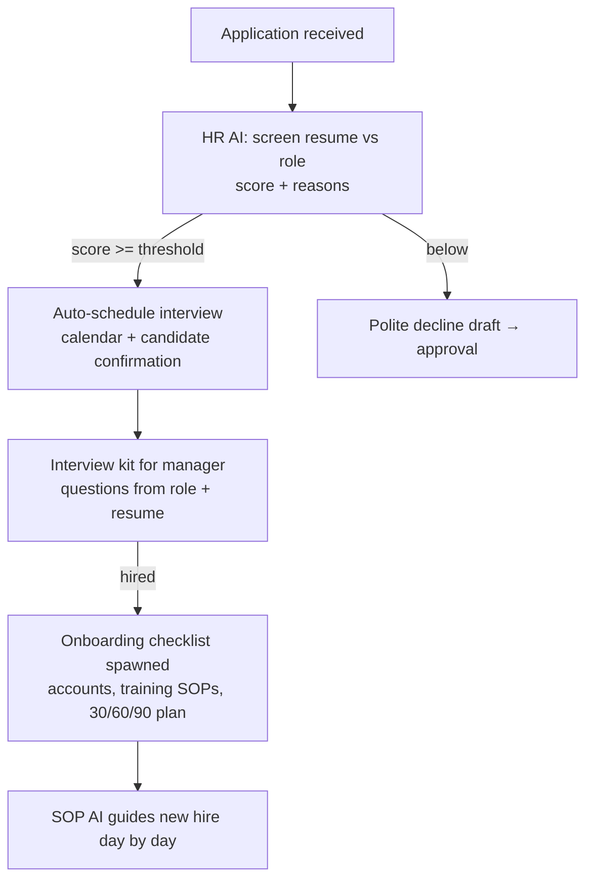
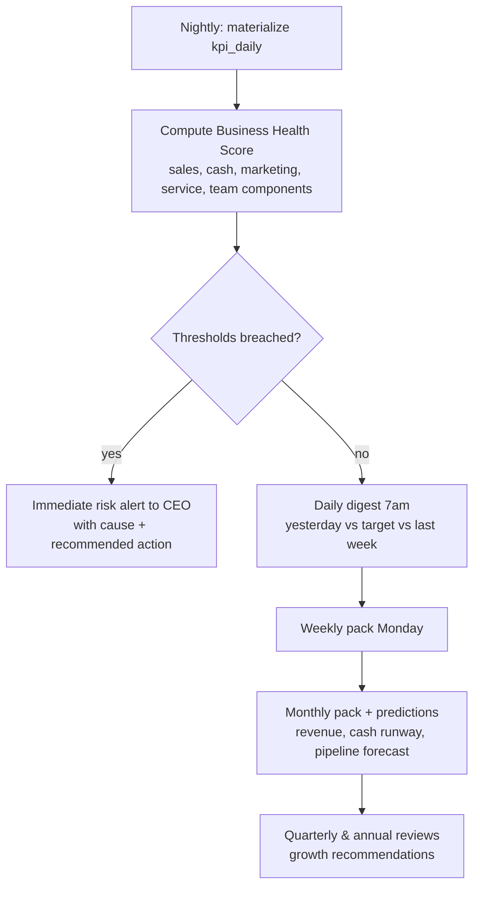

# 6. Automation Workflows

All workflows run on the workflow engine (n8n), triggered by events from the
event catalog ([doc 4 §4.3](04-database-design.md)). Each box that says "AI"
is an agent run with the autonomy policy applied.

## 6.1 Master Flow — Lead to Retention (the money loop)

## 6.2 Customer Support Flow

## 6.3 Content Engine Flow (monthly)

## 6.4 Voice Agent Flows

## 6.5 Finance Month-End Flow

## 6.6 HR Recruitment Flow

## 6.7 Executive Reporting Flow

## 6.8 Workflow Inventory (Phase mapping)

| # | Workflow | Trigger | Phase |
|---|---|---|---|
| W1 | Instant lead response | lead.created / inbound message | 1 |
| W2 | Lead qualification & scoring | conversation update | 1 |
| W3 | Appointment booking + reminders + no-show recovery | qualification / appointment events | 1 |
| W4 | Cold lead re-engagement | lead.gone_cold (60d) | 1 |
| W5 | Daily CEO digest | cron 7:00 | 1 |
| W6 | Content calendar → generate → approve → publish | cron monthly | 2 |
| W7 | Comment/DM engagement + lead detection | platform webhooks | 2 |
| W8 | Voice confirmation & missed-call callback | appointment.booked / missed call | 2 |
| W9 | Quote → invoice → payment → receipt | deal.won | 3 |
| W10 | Dunning (overdue invoices) | invoice.overdue | 3 |
| W11 | Customer onboarding | invoice.paid (first) | 3 |
| W12 | Review request + retention campaigns | onboarding complete / segments | 3 |
| W13 | Support ticket lifecycle + CSAT | ticket events | 3 |
| W14 | Month-end finance pack | cron month-end | 3 |
| W15 | Recruitment pipeline | application received | 3 |
| W16 | Leave & policy requests | leave.requested | 3 |
| W17 | SOP review reminders | sop.review_due | 3 |
| W18 | Health score + risk alerts + periodic packs | nightly cron | 4 |
| W19 | Tenant onboarding wizard | new tenant | 4 |
