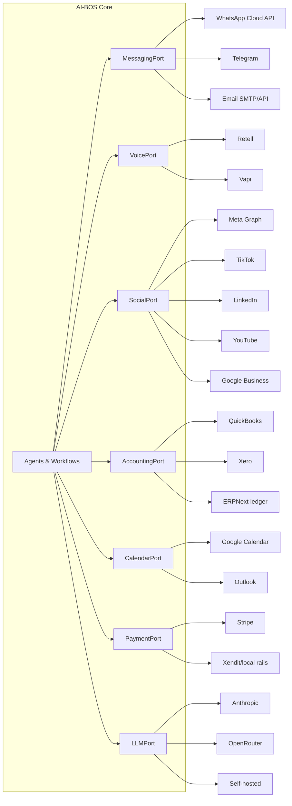

# 9. Integrations

## 9.1 The Adapter Pattern (modularity guarantee)

Every external tool is wrapped in an **adapter** implementing a standard
interface per capability. Agents and workflows call the interface, never the
vendor. Swapping vendors = writing one adapter + flipping tenant config.

## 9.2 Recommended Integrations by Category

| Category | Primary | Notes |
|---|---|---|
| Messaging | WhatsApp Business Cloud API, web chat widget (build), email | WhatsApp templates pre-approved for reminders/broadcasts; unified inbox in Staff Workspace |
| AI voice | Retell AI or Vapi over Twilio/Telnyx numbers | Webhooks deliver transcript/summary/sentiment back into `voice_calls` |
| Automation platform | n8n self-hosted | Also the tenant-visible "workflow editor" |
| Accounting | QuickBooks Online, Xero | Two-way: invoices/payments out, expenses/P&L in |
| ERP | ERPNext REST API | Inventory, purchasing, suppliers, projects |
| Calendar | Google Calendar, Microsoft 365 | Free/busy for booking; two-way event sync |
| Email sending | Resend/Postmark (transactional), Listmonk/Brevo (campaigns) | Separate IPs/domains for marketing vs transactional deliverability |
| Cloud storage | S3/R2 internal; Google Drive connector for tenant docs | Drive/folder sync feeds the knowledge base |
| Payments | Stripe (+ Xendit or local gateway per market) | Payment links in chat; webhooks drive `invoice.paid` |
| Social platforms | Meta Graph API (FB+IG), TikTok Business, LinkedIn, YouTube Data, Google Business Profile | App review lead times: start Meta/TikTok approvals in Phase 1 even though features ship Phase 2 |
| Ads data | Meta Ads, Google Ads APIs | Campaign spend/results into `campaigns.results` for ROI reporting |
| Analytics | GA4/Plausible for web; internal `kpi_daily` is the source of truth for the dashboard | |
| LLM/image/TTS | Anthropic + OpenRouter router; image gen (already prototyped in `nano_banana.py`); ElevenLabs TTS | All via LLMPort with cost tagging |
| Design | Canva API for branded templates | Content AI fills templates for consistent visuals |
| E-sign | Dropbox Sign / DocuSign | Quotes → signed agreements |
| Payroll | Local provider per market (e.g. Gusto, PayrollPanda) | Read-mostly integration; HR AI never writes payroll unattended |

## 9.3 Integration Ground Rules

1. **Webhooks in, queue first:** every inbound webhook lands in the job queue
   (verified, deduplicated, retried) before touching business logic.
2. **Idempotency everywhere:** external side effects carry idempotency keys —
   a retried workflow never double-sends an invoice or a broadcast.
3. **Per-tenant credentials:** each tenant connects *their own* WhatsApp
   number, ad accounts, QuickBooks — stored encrypted, scoped, revocable.
4. **Health monitoring:** adapter-level status (token expiry, rate-limit
   budget, webhook failures) surfaces on the admin panel and the CEO
   dashboard's "AI Agent Status" tile.
5. **Graceful degradation:** if a vendor is down, workflows park and retry
   with backoff, and the affected agent announces reduced capability instead
   of failing silently.
