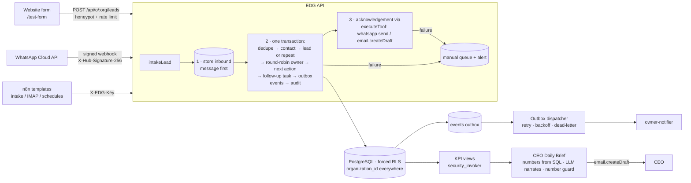
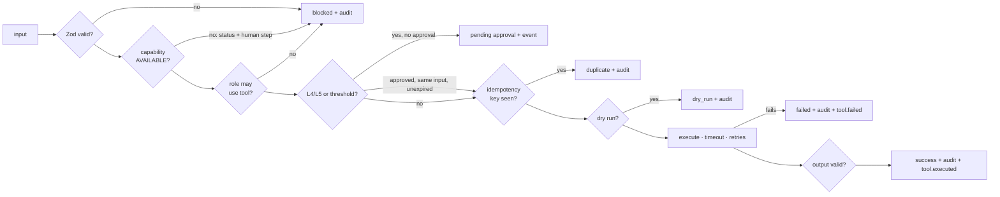

# Architecture

## The first vertical slice

## The safety pipeline (every runtime tool)

## Tenancy
- **Tenant context.** The JWT claim `organization_id` (Supabase), or `set_config('app.organization_id', …, true)` in
  server transactions. Also `app_role` and `actor_type`.
- **RLS.**
  - Every table in `public` has RLS enabled and forced.
  - Policies combine "same organisation" with "role allowed for this operation".
  - `audit_logs` has no UPDATE/DELETE policy, the grants are revoked, and a trigger refuses changes even for the owner.
- **Cross-org helpers.** Exactly two narrow `SECURITY DEFINER` functions: `app.claim_events` (outbox) and
  `app.org_id_by_slug`.

## Environments (B13)
DEVELOPMENT (local, MOCK) → TEST (CI, MOCK) → STAGING (Supabase + Vercel preview, sandbox providers, FAKE data) → QA
gate → Ryan's approval → PRODUCTION → monitor.

Today, only DEVELOPMENT/TEST exist. A MOCK adapter is refused in production by `checkCapability()`.

## Build-time vs runtime tools (B3)
- **Build time:** what Claude Code / ATLAS uses to build: git, the GitHub connector, the n8n MCP, the Vercel MCP,
  Docker, local Postgres.
- **Runtime:** the `ToolRegistry` inside the delivered product (`crm.createContact`, `whatsapp.send`, …), used by the
  client's agents and workflows through `executeTool()`.
