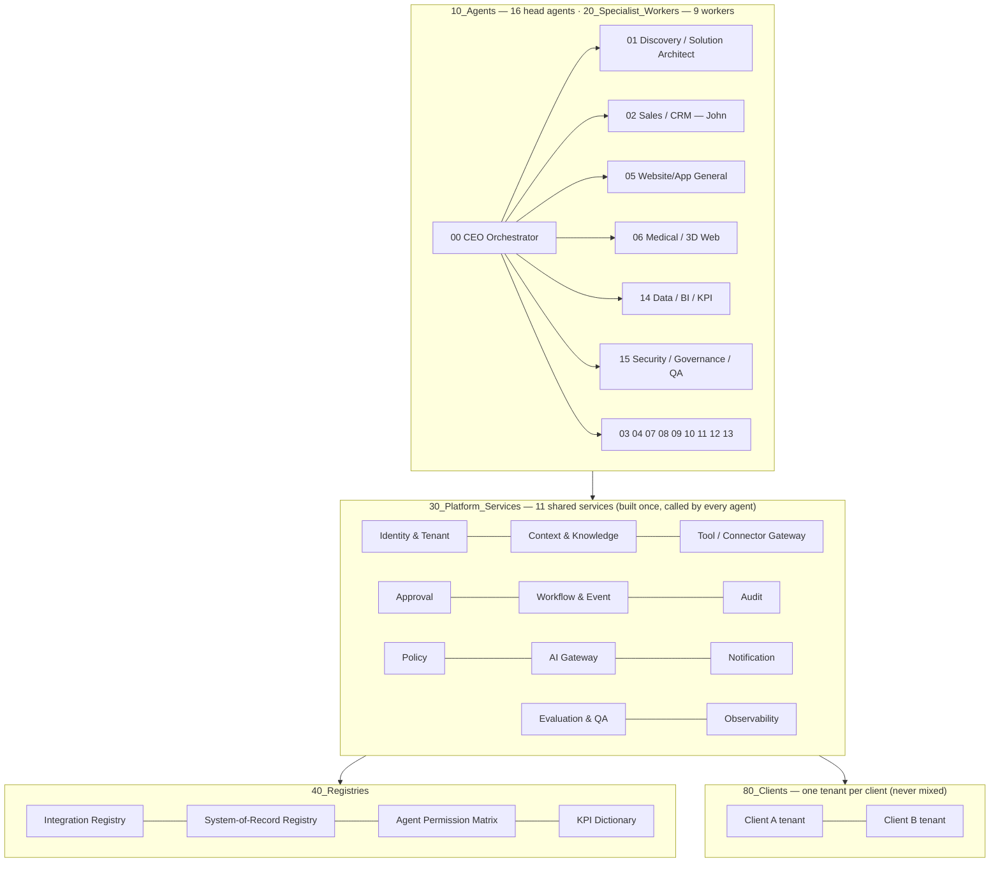

# 01 · Architecture v3 — agents on top, shared services underneath, registries beside, one tenant per client

> Plain words: the **agents** are the staff. The **platform services** are the building they work in (doors, keys, cameras, mailroom). The **registries** are the phone book. Each **client** gets its own locked office. Nothing is built twice.

## The picture

## Layer by layer
| Layer | What it is | Where it lives today | Notes |
|---|---|---|---|
| **Agents** | 16 head agents + 9 specialist workers, each on the [[90_Templates/Agent_Contract_TEMPLATE|Universal Agent Contract]] | Vault notes in `10_Agents/`, `20_Specialist_Workers/`; running ones in n8n from `ceo-brain/agents/<id>/` | Live today: John, Discovery, Website Builder (SME + Medical), Daily Brief (v0) |
| **Platform services** | permissions, tenants, approvals, events/retries, audit, policy, AI access, notifications, evaluation, observability, knowledge | `30_Platform_Services/` (design), n8n workflows + data tables (running parts), Postgres migration `002_crm_erp_core.sql` (target) | Agents call these; they never rebuild them |
| **Registries** | integrations, sources of truth, permissions, KPIs | `40_Registries/` | Status fields are real: `planned` until Ryan confirms |
| **Tenants** | one isolated workspace per client | `80_Clients/<client>/` in the vault; `tenant_id` + RLS in the database; separate n8n credentials per client | Never mixed |
| **Knowledge** | long-term company knowledge, playbooks, decisions | this vault (Obsidian), read live by agents | [[Knowledge/_How the brain feeds the agents]] |
| **Live data** | leads, contacts, tasks, orders, invoices status | n8n Data Tables now → Postgres/Supabase (39 tables, RLS) | designed in `ceo-brain/database/` |
| **Orchestration** | every workflow | n8n | Code nodes generated from the repo |
| **Reasoning** | every judgement call | Claude via the [[30_Platform_Services/AI_Gateway]] | rule engines as fallback |

## Database / tenant model (target, already written as a migration)
- Every table carries `tenant_id`; Row Level Security policy `tenant_isolation` on every table.
- Keys: `tenant_id` + `id` (uuid). Cross-entity references always inside the same tenant.
- CRM: organizations, contacts, leads, opportunities, deals, pipelines + stages, conversations, messages, tasks, appointments, quotations, projects, activities, documents.
- ERP (optional per tenant): orders, suppliers, purchasing, inventory + stock movements, service jobs, invoices, payments (status only), employees + roles.
- Platform: tenants, tenant modules, users + roles, integrations (secret **references** only), data sources, company maps (versioned), approvals, agent runs, workflow runs, audit logs.
- Source: `ceo-brain/database/migrations/002_crm_erp_core.sql` and `ceo-brain/database/crm-erp-data-layer.md`.

## Approval model (summary; detail in [[30_Platform_Services/Approval_Service]])
AI recommends → approval request with reason, amount, tenant, deadline → the right approver (see matrix) → approve / reject / edit → execution → audit. Timeouts escalate; nothing executes on silence.

## Event / retry model (summary; detail in [[30_Platform_Services/Workflow_Event_Service]])
Every event has a `correlation_id` and an `idempotency_key`. Retries are limited (3, exponential); failures go to an exception queue with a dead-letter list and a manual-recovery task in the [[20_Specialist_Workers/Approval_Inbox_Agent|human task inbox]]. No silent failures.

## Environments (detail in [[30_Platform_Services/Deployment_Environments]])
Dev (FusionTech's own business as the pilot) → Staging (client UAT, test data) → Production. Release gate = tests green + security check + human sign-off + rollback tested.

## Build order
[[00_CEO_Brain/02_Build_Backlog]] — the ten phases of Build order v2. First sellable package: Discovery + CEO Brain + CRM + AI Sales Agent + Workflow Automation + WhatsApp/Email + Dashboard + premium website mock-up.
