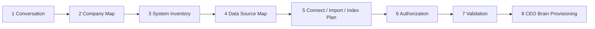

# Client Onboarding & Data Discovery (P0 #1)

## Purpose
Understand a new client's business by **conversation**, never by asking them to organize or send "all their data". End result: a provisioned CEO Brain tenant with only the data sources that matter, connected or imported the right way.

## The flow (8 steps)

| Step | What happens | Who | Output | Status today |
|---|---|---|---|---|
| 1 Conversation | Consultant-style chat, max 3 questions per turn, 13 topics ([[50_Client_Onboarding/Discovery_Questions]]) | Discovery Agent (live: Discovery Console) | transcript in `Discovery/` | live |
| 2 Company Map | Facts merged turn by turn, coverage tracked, nothing invented | Discovery Agent | [[Templates/Client Digital Company Map]] note, versioned in `ceo_company_maps` | live |
| 3 System Inventory | Every tool named (CRM, accounting, WhatsApp, sheets, POS…) with owner and use | Discovery Agent + Solution Architect | "Current software" section of the map | live (partial) |
| 4 Data Source Map | Each data category classified AVAILABLE / NOT AVAILABLE / UNKNOWN / CONNECTION REQUIRED / IMPORT REQUIRED / NOT REQUIRED, with source, owner, format, volume, sensitivity | Discovery Agent | data-sources table in the map | live |
| 5 Connect / Import / Index Plan | Each source gets a handling rule ([[50_Client_Onboarding/Data_Classification_Rules]]) | Solution Architect | plan table + [[40_Registries/Integration_Registry]] entries `planned` | designed |
| 6 Authorization | Client owner authorizes each connection (OAuth where possible); FusionTech never receives passwords | Client owner + [[30_Platform_Services/Tool_Connector_Gateway]] | registry entries `authenticated` | designed |
| 7 Validation | Test each connection / import (counts match, sample records, dry run) | [[20_Specialist_Workers/Data_Migration_Worker]], [[20_Specialist_Workers/Integration_Health_Worker]] | registry entries `tested`; migration report | designed |
| 8 CEO Brain Provisioning | Tenant created, modules chosen, agents configured, dashboards on | [[30_Platform_Services/Identity_Tenant]] + Orchestrator | `80_Clients/<client>/` folder, tenant rows | designed |

## Rules
- Never "send us all your data". Ask what they do, where information lives, what hurts.
- Collect only what the chosen modules need; sensitive data (health, payroll, ID numbers) only with a stated purpose and Ryan's OK.
- Every promised integration must exist in the [[40_Registries/Integration_Registry]] before the proposal mentions it; status stays `planned` until tested.
- Pricing never appears in discovery; the proposal draft has no numbers.

## Data model
Company map (`ceo_company_maps`, versioned, `tenant_id`), data sources (`data_sources`: category, availability, source_system, owner, format, volume, sensitivity, handling, import_method, authorization_required), integrations (references only).

## Tests
- A 4-turn test conversation reaches ≥75% coverage and produces a valid map (repo test suite, passing).
- No turn asks for a password or for "all your data" (guardrail test, passing).
- Step 5 plan lists every AVAILABLE / CONNECTION REQUIRED / IMPORT REQUIRED source exactly once.

## Status
Steps 1–4 live (Discovery Console `9TnzsgPGRatMaQI3`). Steps 5–8 designed; build in backlog Phase 2.
