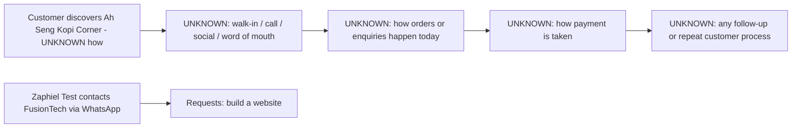

# Current state — Ah Seng Kopi Corner

# Current State — Ah Seng Kopi Corner

**Status: Very early discovery. Only one request has been made — a website. No business workflow details have been shared yet.**

**Narrative:**
Ah Seng Kopi Corner reached out over WhatsApp asking for a website to be built. This is the only confirmed fact about their operations so far. We do not yet know what the business actually does day-to-day (industry is inferred as a café/kopi shop from the name only, not confirmed), how customers currently find them, how orders/enquiries are handled, how payment works, or whether there is any existing follow-up process. There is no information yet on team size, current tools, or what problem the website is meant to solve.
