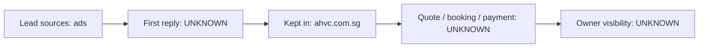

# Current state — Asian Heart & Vascular Centre

## What we know (CLIENT-PROVIDED)
- Lead sources: ads
- How enquiries are followed up: UNKNOWN
- Tools in use: ahvc.com.sg
- Accounting / ERP: UNKNOWN
- WhatsApp: UNKNOWN

Everything marked UNKNOWN is an open question for John (see 15_questions_open). Nothing here is inferred.
