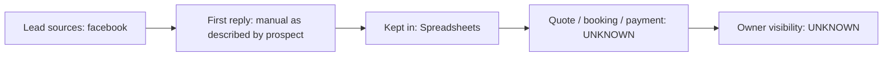

# Current state — ATLAS Test Renovation Pte Ltd

## What we know (CLIENT-PROVIDED)
- Lead sources: facebook
- How enquiries are followed up: manual (as described by prospect)
- Tools in use: Spreadsheets
- Accounting / ERP: UNKNOWN
- WhatsApp: used

Everything marked UNKNOWN is an open question for John (see 15_questions_open). Nothing here is inferred.
