# Scenario A — electrical company, 15 electricians (TEST, FAKE DATA)

> **Test only.** Nothing was built, connected, researched on the web or sent to anyone. The only input is the
> customer's first message:
> *"I run an electrical company. I have 15 electricians. Everything is messy. My electricians keep forgetting jobs."*
>
> Discovery readiness (D9 coverage tracker): **0 / 14 fully ticked**, 3 partly known (company, employees, major
> problems). Under D10/D13 ATLAS does not design for real yet. Everything in section 7 is a **working hypothesis**
> to steer the questions. It is not shown to the customer and not put up for approval.

---

## 1. Discovery questions first

### What ATLAS asks now (one message, 3 related questions)
The symptom table in the pack says: *"Everything is messy" → walk through the last real job first*, and
*"Staff forget jobs" → job intake, scheduling, assignment, how staff receive info, completion proof.* So ATLAS opens
with one real example and not with a questionnaire:

> "Thanks, that helps. With 15 electricians out on jobs, it's very common for things to slip when job details are
> scattered, so you're not alone. Let me understand how it works today before suggesting anything.
>
> 1. Take the last job you did as an example. How did the customer reach you, and how did that job end up with the
>    electrician who did it?
> 2. How do your electricians get their jobs today (phone call, WhatsApp, a paper list, a shared calendar, something
>    else)? And how do they tell you a job is done?
> 3. When a job gets forgotten, what usually happens? Who notices first, and roughly how often does it happen?"

### What ATLAS asks next (prioritised; 1–3 at a time, each answer decides the next)
| # | Question (plain words) | Why ATLAS needs it | Ask when |
|---|---|---|---|
| 1 | "Who in the company takes the bookings and decides which electrician goes where? Is that you, an office person, or a supervisor?" | Who owns scheduling and assignment, and whether there is an office team at all | Right after the first answers |
| 2 | "Where is the full list of upcoming jobs kept today, if anywhere? Could you show me a screenshot of it (just the column headings is fine)?" | Is there one job list or several? Existing tool to keep or move (D6/D7) | Same round as 1 |
| 3 | "What kind of work is most of it: short call-outs and repairs, or bigger installation jobs that run over several days?" | Confirms FIELD-SERVICE EDG vs a PROJECT/OPS or HYBRID system | Round 2 |
| 4 | "Who are your customers mostly: homeowners, businesses, building managers, or other contractors?" | Shapes the customer record and how jobs arrive | Round 2 |
| 5 | "Before a job, do you usually visit the site and send a quote? How are quotes made today?" | Whether quotations belong in the first phase | Round 3 |
| 6 | "After a job is done, how long does it usually take before the customer gets the invoice, and what do you use to make invoices?" | Completion-to-invoice gap; accounting tool to keep and connect | Round 3 |
| 7 | "Which apps or software does the team use every day?" | Tools inventory (KEEP/CONNECT/MIGRATE…) | Round 3 |
| 8 | "Do all your electricians have a smartphone they use for work? Is the phone signal sometimes bad on site?" | Whether a phone job card or calendar works for them; offline need | Round 4 |
| 9 | "Do electricians need to fill in anything after a job, like a checklist, test results, photos or the customer's signature?" | Whether proof of completion (job card) is needed now or later | Round 4 |
| 10 | "Do electricians collect materials from a store or carry stock in the van? Is that tracked?" | Materials/inventory. Later phase unless it is a stated pain | Round 5 |
| 11 | "If you opened one screen each morning, what would you want to see about the business?" | Management view and KPIs | Round 5 |
| 12 | "Where is the company based?" | Which privacy rules apply (e.g. PDPA if Singapore) | Any time, naturally |

After 5–6 answers ATLAS plays back a summary: *"So far I understand… Did I get that right?"*

---

## 2. What ATLAS knows

| # | Fact | Label |
|---|---|---|
| 1 | The company does electrical work | CLIENT-PROVIDED |
| 2 | It has 15 electricians | CLIENT-PROVIDED |
| 3 | The owner describes the company as "messy" | CLIENT-PROVIDED |
| 4 | Electricians keep forgetting jobs | CLIENT-PROVIDED |
| 5 | The person writing is the owner ("I run…") | CLIENT-PROVIDED (role); name UNKNOWN |
| 6 | Electricians do the work at customers' sites | INFERENCE (normal for electrical work; confirm) |
| 7 | Jobs reach electricians in a way that does not stick (verbal, chat or scattered lists) | INFERENCE (hypothesis behind "forgetting jobs"; confirm with Q2) |
| 8 | There is no single shared job list that everyone works from | INFERENCE (to confirm) |
| 9 | Company name, website, location/country | UNKNOWN |
| 10 | Office/admin staff, supervisors, total headcount besides the 15 electricians | UNKNOWN |
| 11 | Customer types (homes, businesses, contractors) | UNKNOWN |
| 12 | How customers contact the company (phone, WhatsApp, website, referrals…) | UNKNOWN |
| 13 | Who takes bookings and who assigns jobs | UNKNOWN |
| 14 | How jobs are passed to electricians today | UNKNOWN |
| 15 | How completion is reported | UNKNOWN |
| 16 | How often jobs are forgotten, and what it costs | UNKNOWN |
| 17 | Job types (call-outs vs multi-day installations) | UNKNOWN |
| 18 | Quotation process | UNKNOWN |
| 19 | Invoicing, payment methods, accounting software | UNKNOWN |
| 20 | Software in use (Excel, WhatsApp, calendar, accounting…) | UNKNOWN |
| 21 | Electricians' phones and site signal | UNKNOWN |
| 22 | Forms, test results, photos or sign-off required after a job | UNKNOWN |
| 23 | Materials and stock handling | UNKNOWN |
| 24 | Job volume per day, week or month | UNKNOWN (no number may be assumed) |
| 25 | Budget, deadline | UNKNOWN (and never ATLAS's to discuss; see section 9) |

---

## 3. Assumptions to confirm
1. Electricians work at customer sites, not in a workshop. (Q1/Q3)
2. "Forgetting jobs" means a job is booked but the electrician does not show up or does not do it on time. It may
   also mean forgetting parts of a job or follow-up visits. (Q3, ask for a recent example)
3. There is no single shared job list today. (Q2, next Q2)
4. Someone other than the electricians (owner or office) books and assigns jobs. (next Q1)
5. Most work is short jobs and not long projects. (next Q3; if wrong → PROJECT/OPS or HYBRID)
6. Electricians have smartphones they can use for work. (next Q8)
7. "Messy" covers more than forgotten jobs (for example quotes, invoices, customer details). It is unknown what. (Q1, next Q5–7)
8. Location is unknown. Privacy rules are decided only once the country is known. (next Q12)

None of these is used as fact in the design below until the customer confirms it.

---

## 4. Knowledge used
| File opened | Why |
|---|---|
| `.claude/agents/atlas.md` (full, incl. BUSINESS SYSTEMS INTELLIGENCE v3, B19, B20) | ATLAS's instructions |
| `60_Skill_Packs/ATLAS_Business_Systems/00_Index.md` | Router: symptom table matched "Everything is messy" (→ discovery first, last real journey) and "Staff forget jobs" (→ Field Service / Ops) |
| `60_Skill_Packs/ATLAS_Business_Systems/11_Field_Service.md` | The index row says open it when "my staff forget jobs"; electricians work on site |
| `60_Skill_Packs/ATLAS_Business_Systems/Archetypes/Field_Service.md` | Ryan's archetype names electrical companies explicitly |

**Deliberately not opened yet:** 01 Sales CRM, 02 Follow-Up, 05 Documents, 06 Calendar, 08 Accounting, 13 Inventory,
24 Payments, 28 Dashboard, 29 CEO Brief. The archetype lists some of them as typical modules, but the customer has
not yet described a problem in those areas. They are opened only if discovery shows that need (rule: open ONLY the
matching cards).

---

## 5. System type
**FIELD-SERVICE EDG (provisional).**

Reason (SYSTEM-TYPE DECISION RULES): the work is done on site by staff (electricians = technicians). The stated pain
is about **jobs being delivered**, not about leads or deals. That fits "jobs, scheduling, mobile job card,
completion proof". It is **not SALES-CRM**: nothing the customer said is about leads, quotes or winning deals. The
archetype also warns that building only a sales CRM is the trap here. It is **not ERP-LIKE**: none of the 3+
criteria is known (multi-location stock, procurement approvals, POs, etc.).

What would change it: if most work turns out to be multi-day installations with many steps and dependencies →
**PROJECT/OPS EDG** or **HYBRID** (field service + project). If materials/stock turn out to be a major pain →
re-check card 13 and the ERP-LIKE rule.

---

## 6. Provisional design (to confirm after discovery)

### 6.1 Current-state map (what is known vs UNKNOWN)

```mermaid
flowchart LR
    A["Customer needs electrical work"] --> B["UNKNOWN: how customer contacts company<br/>(phone? WhatsApp? website? referral?)"]
    B --> C["UNKNOWN: who takes the booking"]
    C --> D["UNKNOWN: site visit / quote?"]
    D --> E["UNKNOWN: who assigns the electrician<br/>and where the job is recorded"]
    E --> F["UNKNOWN: how the job is passed<br/>to the electrician"]
    F --> G{"Electrician remembers<br/>the job?"}
    G -- "no (CLIENT-PROVIDED pain)" --> X["Job forgotten<br/>UNKNOWN: who notices, how often"]
    G -- yes --> H["Electrician does the work on site<br/>(INFERENCE)"]
    H --> I["UNKNOWN: how completion is reported"]
    I --> J["UNKNOWN: invoice / payment"]

    classDef unknown stroke-dasharray: 5 5;
    classDef pain stroke-width:3px;
    class B,C,D,E,F,I,J unknown;
    class X pain;
```

### 6.2 Problem map
| # | Problem | Source | Likely causes to check (hypotheses, not facts) | Impact |
|---|---|---|---|---|
| P1 | Electricians keep forgetting jobs | CLIENT-PROVIDED | Jobs passed verbally or in chat and buried; no single job list; no reminder; nobody confirms the electrician saw the job; nobody notices a job was not done until the customer complains | Not stated by client. Frequency and cost UNKNOWN (no numbers estimated) |
| P2 | "Everything is messy" | CLIENT-PROVIDED, undefined | Unknown. Could be customer details, quotes, invoices, schedules or materials | UNKNOWN until Q1 and follow-ups |

ATLAS does not automate P1 until it knows *why* jobs are forgotten (operating principle: never automate a broken
workflow without understanding why it is broken).

### 6.3 Minimum modules vs later/optional
Traceability: every module points to a stated problem. The archetype trap applies: *fix how jobs come in before
building the job card.*

**Minimum (solves P1, if hypotheses are confirmed)**
| Module | What it does in plain words | Solves |
|---|---|---|
| M1 One job list | Every job is written in one place, with customer, address, time and the assigned electrician. It is the only source of truth for jobs | P1 (no single list) |
| M2 Job sent to the electrician | When a job is assigned, it appears on the electrician's phone (staff app Jobs tab and/or their calendar) | P1 (job never reached them clearly) |
| M3 Reminder before the job | Automatic reminder to the electrician before the job (timing [CLIENT TO DEFINE]) | P1 (forgot on the day) |
| M4 "Not done" alert to the owner/office | Jobs still open after their time are flagged to the owner or office, so nothing silently disappears | P1 (nobody notices) |
| M5 Mark job done | Electrician taps "done" on the phone; the office sees it | P1 (completion invisible) |

**Later / optional (only if discovery shows the need)**
- Mobile job card with checklist, photos, materials, customer signature (if proof of completion is a pain).
- Customer enquiry intake + customer list (if enquiries get lost too).
- Quotations from an approved price list (if quotes are slow).
- Invoices after completion + accounting connection (if billing is slow).
- AI assistant answering customers and booking jobs (if message volume justifies it).
- Customer reminders before the visit (if no-shows or "nobody came" complaints exist).
- Morning owner summary / KPI dashboard (once the job data is flowing).
- Materials / van stock (if it is a stated pain).
- **Not recommended:** live location tracking of electricians. Only ever with clear staff consent and a written
  policy, and nothing so far suggests it is needed.

### 6.4 Per-process classification
| Process | Classification | Note |
|---|---|---|
| Customer contacts the company | UNKNOWN → likely KEEP HUMAN now, AI ASSIST later | Depends on channels and volume |
| Recording a new job | REDESIGN | One entry point into the job list instead of scattered notes/chats (if that is the case) |
| Deciding which electrician does which job | KEEP HUMAN | The owner/office decides; the system blocks double booking |
| Telling the electrician about the job | AUTOMATE | Job appears on their phone/calendar when assigned |
| Reminding the electrician | AUTOMATE | Before the job; timing set by the client |
| Electrician confirming they saw the job | AUTOMATE (if wanted) | Possible NEW BUILD (see 6.6) |
| Doing the electrical work, safety and technical decisions | KEEP HUMAN | Never an AI's decision |
| Marking the job complete | KEEP HUMAN (one tap) | Completion is a human decision in Fusion EDG Core |
| Chasing jobs that were not done | AUTOMATE | Alert to the owner/office; a person follows up |
| Re-typing the same job details into several places | REMOVE (if found) | Confirm in discovery |
| Quotes, invoices, payments | UNKNOWN | Classified after Q5/Q6; payments and outcomes always stay human |
| Reviewing electricians' performance | KEEP HUMAN | Data informs the owner; no employment decisions by AI |

### 6.5 Keep / connect / buy / build
- **Existing tools:** UNKNOWN (next Q7). Decision template once known: chat app → KEEP for talking to customers and
  CONNECT later; spreadsheet or paper job list → MIGRATE its columns into the job list (structure only, no customer
  rows in notes); accounting software → KEEP and CONNECT, never rebuild.
- **Buy vs build (card 11):** compare a mature field-service product with Fusion EDG Core plus the job card. Choose
  by fit to their flow, the electricians' phones and cost. No product is named here: no web research was done in
  this test, and Singapore availability/pricing must be checked first. ATLAS recommends; Ryan decides.

### 6.6 Fusion EDG Core today vs NEW BUILD (from the B19 catalog and card 11)
| Need | Fusion EDG Core today | Status |
|---|---|---|
| M1 One job list + assignment, no double booking | Appointments module + staff app Jobs tab | TESTED |
| M2 Job on the electrician's phone | Staff app Jobs tab (one-time sign-in links; proper logins not built yet) | TESTED |
| M2 Job in the electrician's calendar | Google Calendar connection (bookings appear in staff calendars) | TESTED (MOCK); live NEEDS VERIFICATION |
| M3 Reminder before the job | Appointments has confirmations and 24 h reminders. Whether these reach the **electrician** (not only the customer) must be checked; a staff reminder at a client-chosen time may be NEW BUILD | TESTED for what exists; staff-side reminder **to check** |
| M4 "Not done" alert to the owner | Safe workflow catalog: `schedule` (daily) + condition `job_still_booked` + `notify_owner` / `owner_summary` (scheduled workflows inform the owner only) | Standard catalog (rehearsed at build) |
| M5 Mark job done | Appointments: completed / no-show is a human action | TESTED |
| Electrician acknowledges the job ("seen") | Not in the catalog | **NEW BUILD** |
| Mobile job card (checklist, photos, materials, signature, weak-signal/offline) | Not in the catalog | **NEW BUILD** |
| Materials / van stock | Inventory not in the catalog | **NEW BUILD** (only if needed) |
| Customer intake, quotations, invoices, Xero, AI assistant, CEO Daily Brief | In the catalog (statuses per B19) | Later phase, only if discovery shows need |

WhatsApp note: if job alerts go to electricians or customers over WhatsApp, messages sent more than 24 h after the
person's last message need an approved template; otherwise a person sends them.

### 6.7 KPIs (each answers a management question; targets [CLIENT TO DEFINE]; values only from connected data)
| KPI | Management question | Data source |
|---|---|---|
| Jobs completed vs jobs scheduled (per day/week) | Are we delivering what we booked? | Job list |
| Forgotten jobs: still open after their scheduled time | Which jobs fell through the cracks today, and who needs to act? | Job list + M4 alert |
| Late jobs | What is late right now? | Job list (scheduled vs started/completed) |
| Jobs assigned but not acknowledged (only if acknowledgement is built) | Did every electrician actually see their jobs? | NEW BUILD data |
| Callbacks / rework (later) | Is the work done right first time? | Job list (callback flag) |
| Completion-to-invoice time (later) | Are we slow to bill? | Job list + invoices |

No baseline exists. No number is assumed.

---

## 7. Report to John

**In plain words:** The owner runs an electrical company with 15 electricians. The main problem he named is that
electricians forget jobs, and he feels the whole company is messy. This looks like a company whose work happens at
customers' sites, so the fix is probably about how jobs are recorded, handed to the electricians and checked off.
A sales system is probably not the main answer. We don't know yet *why* jobs are forgotten, so we are not proposing
anything yet. Please don't mention any software, price or timeline.

**Ask the customer now (one message):**
1. "Take the last job you did as an example. How did the customer reach you, and how did that job end up with the
   electrician who did it?"
2. "How do your electricians get their jobs today (phone call, WhatsApp, a paper list, a shared calendar, something
   else)? And how do they tell you a job is done?"
3. "When a job gets forgotten, what usually happens? Who notices first, and roughly how often does it happen?"

**Then, depending on the answers (1–3 at a time):**
- "Who takes the bookings and decides which electrician goes where?"
- "Where is the full list of upcoming jobs kept today? A screenshot of the column headings is enough."
- "Is most of the work short call-outs and repairs, or bigger jobs over several days?"
- "Who are your customers mostly: homes, businesses, building managers or contractors?"
- "Which apps does your team use every day?"
- "Do all your electricians have a smartphone they use for work?"

If he asks about cost or timing: *"Once I understand your setup, our team will send you a clear proposal with scope,
timeline and cost."* Never ask for passwords or logins.

---

## 8. Items for Ryan
- **Pricing, timeline, scope proposal:** never quoted by ATLAS or John. Ryan only.
- **Buy vs build decision** (mature field-service product vs Fusion EDG Core + job card), once discovery is done and
  Singapore options are researched.
- **NEW BUILD items** that may be needed before anything is promised: electrician job acknowledgement, staff-side
  reminder (if Appointments reminders are customer-only), mobile job card (checklist/photos/signature/offline),
  materials tracking.
- **Location tracking:** if the customer asks for it, it needs a staff consent policy (human/legal review). Not
  recommended by ATLAS.
- **Privacy jurisdiction:** unknown until the company's location is confirmed (PDPA if Singapore). Flag for human review.
- **Approvals:** checkpoint 1 (company model + current state + problem map) after discovery; DESIGN → BUILD only with
  Ryan's written approval.
