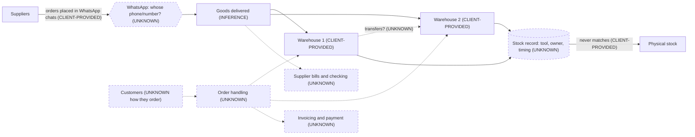

# Scenario B · Wholesale distributor, 2 warehouses (run 2)

> TEST with FAKE data. Nothing was built, connected, researched online or sent to anyone. The only input is the
> customer's first message:
> *"We're a wholesale distributor with 2 warehouses. Stock never matches and purchasing is all on WhatsApp."*
> Everything else in this note is labelled INFERENCE, UNKNOWN or an assumption to confirm. No numbers were invented.

---

## 1. Discovery questions first

ATLAS is in DESIGN MODE, but the Final Discovery Check (D10) does not pass: we cannot yet explain how the company
operates today. Per the v3 NOTES, the company is labelled **ERP-LIKE (provisional)** at once, and the **ERP question**
(what system they use today; KEEP / INTEGRATE / BUY before any custom build) is the first thing discovery confirms.

### Ask now (1–3 questions, plain words)

Acknowledge first:
> "Thanks, that's very clear. Stock that doesn't match and purchasing on WhatsApp are two of the most common
> headaches for distributors, and they're usually connected. Before I suggest anything, I'd like to understand how
> things work today."

1. **(ERP question)** "What do you use today to keep track of stock and purchases? For example an accounting or
   stock program, Excel, or mostly WhatsApp and people's memory?"
2. **(Stock pain, real example)** "Could you tell me about a recent time the stock didn't match? Was it the record
   versus what was actually on the shelf, or the two warehouses not agreeing with each other?"
3. **(Purchasing, real example)** "Take the last order you placed with a supplier: who decided to buy, how was it sent
   on WhatsApp, and what happened when the goods arrived?"

### Next questions (after those answers; prioritised, 1–3 at a time, skip anything already answered)

| # | Question (as the customer hears it) | Why ATLAS needs it |
|---|---|---|
| 4 | "If you use a program: which one, who uses it every day, and do you also record stock and purchases in it, or only invoices?" | KEEP / INTEGRATE / BUY decision (card 20) |
| 5 | "Roughly how many different products do you carry, and do goods move between the two warehouses?" | Multi-location stock, transfers (card 13) |
| 6 | "Who updates the stock figures today, and when: when goods arrive, when they leave, at the end of the day?" | Where movements get lost (card 13) |
| 7 | "Who is allowed to buy from suppliers? Is there an amount above which someone has to approve it?" | Procurement-with-approvals criterion (card 14) |
| 8 | "When a delivery arrives, how do you check it against what was ordered? And how do you check the supplier's bill?" | POs + receiving criterion, 3-way match (card 14) |
| 9 | "How do your customers place orders with you, and how does an order reach the warehouse?" | Sales/outbound side, reservation, possible CRM need (archetype) |
| 10 | "How often do you count stock, and when you do, how far off is it?" | Baseline for the stock-accuracy KPI (only if they give a number) |
| 11 | "Do you repack, assemble or make anything? Do you track batches, expiry dates or serial numbers? Do you import goods?" | Manufacturing, batch/serial, landed-cost criteria |
| 12 | "Is it one company, or more than one company or branch whose accounts are combined?" | Financial-consolidation criterion |
| 13 | "Which WhatsApp do you order on: personal WhatsApp, the WhatsApp Business app, or something else? Is it a company number or staff members' own phones? How many people order?" | Company-owned number, history loss risk (card 17) |
| 14 | "If you opened one screen every morning, what would you want to see about stock and purchasing?" | KPIs tied to management questions (B10) |
| 15 | "If this was fixed six months from now, what would be different for you?" | Desired outcome, in the owner's words (B20 step 1) |

Every 5–6 answers ATLAS plays back: "So far I understand… Did I get that right?"

---

## 2. What ATLAS knows

Discovery readiness: **1 / 14** ticked (major problems). Partially understood: company, operations.

| Fact | Label |
|---|---|
| The company is a wholesale distributor | CLIENT-PROVIDED |
| It has 2 warehouses | CLIENT-PROVIDED |
| "Stock never matches" | CLIENT-PROVIDED |
| "Purchasing is all on WhatsApp" | CLIENT-PROVIDED |
| It buys goods from suppliers and sells to business customers | INFERENCE (from "wholesale distributor") |
| Stock is held in both warehouses | INFERENCE (likely; confirm) |
| Goods are received into the warehouses from suppliers | INFERENCE |
| There is no single, trusted stock record across both warehouses | INFERENCE (from "never matches") |
| Purchase orders are not recorded in a system | INFERENCE (from "all on WhatsApp"; there may be a parallel record) |
| Company name, country, website | UNKNOWN |
| Software in use (accounting, stock, ERP, Excel) | UNKNOWN |
| Number of products, suppliers, customers, staff | UNKNOWN |
| Purchase volume, order volume, stock value | UNKNOWN |
| Who buys, who approves, spending limits | UNKNOWN |
| How deliveries are checked; how supplier bills are checked | UNKNOWN |
| Whether goods move between the warehouses | UNKNOWN |
| How stock is updated, by whom, how often it is counted, how far off it is | UNKNOWN |
| How customers order; how orders reach the warehouse; delivery; invoicing; collections | UNKNOWN |
| Which WhatsApp (personal / Business app / platform); company or personal numbers | UNKNOWN |
| Manufacturing/assembly, batch/serial/expiry tracking, imports, multiple entities | UNKNOWN |
| What management wants to see; desired outcome; budget | UNKNOWN |

---

## 3. Assumptions to confirm

1. Both warehouses hold sellable stock (not, for example, one warehouse plus one showroom).
2. "Stock never matches" means the stock record differs from what is physically there (and/or the two warehouses'
   records disagree). Which one it is changes the fix.
3. "Purchasing on WhatsApp" means orders to suppliers are placed in WhatsApp chats with no purchase order recorded
   elsewhere.
4. Suppliers are willing to keep receiving orders on WhatsApp (the channel may need to stay; only the record changes).
5. There is some accounting software or bookkeeper in place (unknown which).
6. Customer-side sales are not the stated problem today, so no CRM is assumed to be needed yet.
7. The business operates in Singapore (FusionTech's market). Not stated; affects PDPA and support options.

---

## 4. Knowledge used

Opened (and only these), following 00_Index:

| File | Why |
|---|---|
| `60_Skill_Packs/ATLAS_Business_Systems/00_Index.md` | Required entry point; SYMPTOM table: "Stock never matches" → Inventory + Procurement |
| `13_Inventory_Warehouse.md` | Signal "Stock never matches", several warehouses |
| `14_Procurement.md` | Signal "Purchasing over WhatsApp" |
| `20_ERP_Intelligence.md` | v3 NOTES: stock + purchasing problems together → ERP-LIKE (provisional), open card 20 |
| `17_WhatsApp_Messaging.md` | WhatsApp is the stated purchasing channel (company-owned number, history-loss risk, platform rules) |
| `Archetypes/Wholesale_Distribution.md` | Closest archetype; it flags the exact traps here (building inventory before the ERP question; POs living only in WhatsApp) |

Not opened (no stated need yet): 01 Sales CRM, 02 Follow-Up, 08 Accounting, 15 Logistics, 28 Dashboard, 29 CEO Brief and
the rest. 08 and 15 are listed as archetype must-haves; they will be opened once discovery confirms the accounting tool
and how deliveries to customers work.

---

## 5. System type

**ERP-LIKE EDG (provisional).**

ERP-LIKE criteria counted (agent file rule, v3 NOTES method):

| # | Criterion | Status | Evidence |
|---|---|---|---|
| 1 | Multi-location stock | **CONFIRMED** | "2 warehouses" + "stock never matches" (stock in both: confirm) |
| 2 | Procurement with approvals | UNKNOWN | Purchasing exists (CLIENT-PROVIDED); an approval step is not known |
| 3 | Purchase orders + receiving | **LIKELY** | A distributor buys from suppliers and receives into warehouses; whether formal POs exist is unknown |
| 4 | Manufacturing / assembly | UNKNOWN | Not mentioned |
| 5 | Landed cost | UNKNOWN | Imports not mentioned |
| 6 | Serial / batch tracking | UNKNOWN | Not mentioned |
| 7 | Financial consolidation | UNKNOWN | Number of entities not mentioned |
| 8 | Many integrated departments | UNKNOWN | Team structure not mentioned |

**Count: 1 CONFIRMED + 1 LIKELY = 2 confirmed-or-likely; 6 UNKNOWN.**

Why provisional ERP-LIKE now:
- Trigger A met: stock problems and purchasing problems appear together.
- Trigger B met: 2 criteria are confirmed or likely.
- The full rule (3+ criteria) is **not yet met**, hence "provisional". Discovery questions 1, 5, 7, 8, 11, 12 test
  the remaining criteria. The label is dropped only if discovery rules them out.

Other types considered:
- COMMERCE EDG (online orders, stock, fulfilment): stock yes, online orders UNKNOWN. Not chosen.
- SALES-CRM: no sales/lead problem stated. Not chosen.
- HYBRID: possible later if the customer-order side (question 9) shows its own problems.

Consequence (v3 NOTES + card 20): **no custom stock or purchasing modules are designed while the ERP question is open.**

---

## 6. Provisional design (to confirm after discovery)

### 6.1 Current-state map (what we know today)

Dashed boxes and dotted lines = UNKNOWN steps, to be filled from discovery.

### 6.2 Problem map

| Problem | Label | Possible causes to test (INFERENCE, not facts) | Frequency / impact |
|---|---|---|---|
| P1 Stock never matches | CLIENT-PROVIDED | stock changed without a recorded movement; receipts not checked against orders; sales/dispatches not deducted; transfers between warehouses not recorded; two separate records for two warehouses; no regular count | UNKNOWN (no numbers given) |
| P2 Purchasing all on WhatsApp | CLIENT-PROVIDED | no purchase-order record outside chats; nothing to check deliveries and bills against; no approval trail; order history tied to individual phones | UNKNOWN |
| P1 ↔ P2 link | INFERENCE | if what was ordered is not recorded, what was received cannot be checked, so the stock record starts wrong at the door | to confirm with the "last supplier order" example |

### 6.3 KEEP / INTEGRATE / BUY / BUILD by area

| Area | Recommendation | Reason |
|---|---|---|
| Stock records (both warehouses) | **KEEP / INTEGRATE** the existing ERP or accounting-with-stock if they have one; otherwise **BUY** a mature inventory/ERP product. **No custom BUILD.** | ERP-LIKE (provisional): never rebuild mature ERP functions; never design custom stock modules while the ERP question is open. Inventory is NEW BUILD in Fusion EDG Core. |
| Purchasing / purchase orders / receiving | **KEEP / INTEGRATE** (same system as stock) or **BUY** with it | Card 14: usually part of the ERP or accounting software. Custom only for an unusual approval chain (none known). |
| WhatsApp with suppliers | **KEEP** as the channel (decision pending Q13) | Suppliers already work this way. What changes is that the order is recorded first, then sent. A company-owned number is recommended (card 17). |
| Accounting | **KEEP / INTEGRATE** (tool UNKNOWN) | Integrate, don't rebuild (card 08 rule in B9). |
| Customer orders / sales | **No decision** | Not described; question 9. |
| Management view (stock accuracy etc.) | **Later**: first from the chosen stock system's own reports; a Fusion CEO brief only if they want one screen across systems | No vanity dashboards; one source of truth for stock figures. |
| Vendors | **None named** | Card 20: verify vendors before naming them; no web research in this test. |

### 6.4 Minimum modules vs later / optional

**Minimum (solves the two stated problems):**
1. One trusted stock record across both warehouses, where stock changes only through recorded movements (receipt,
   dispatch, transfer, adjustment with reason + approver). Lives in the ERP/stock system decided above.
2. Purchase orders recorded in that same system before they go to the supplier, and deliveries received against them
   (full/partial).
3. Data move-in (if they have sheets or an old system): mapping → clean → dry-run → reconciliation → sign-off (B6, §15).

**Later / optional (only if discovery shows the need):**
- Purchase approvals with thresholds (if they have or want a spending limit).
- Supplier-bill check against order and receipt (3-way match).
- Low-stock alert → suggested purchase request.
- An assistant that turns a WhatsApp supplier chat into a draft purchase order for a person to confirm (NEW BUILD).
- Link between the stock system and a Fusion CEO Daily Brief (integration is NEW BUILD).
- CRM / customer ordering by WhatsApp (taking orders by WhatsApp is NEW BUILD), delivery tracking (card 15),
  collections (DSO).

### 6.5 Per-process classification

| Process | Call | Note |
|---|---|---|
| Deciding what to buy | KEEP HUMAN | Later AI ASSIST: low-stock suggestions from the stock system |
| Approving a purchase | KEEP HUMAN | Thresholds from the client; requester is not the approver |
| Placing the order with a supplier | REDESIGN | Record the purchase order first, then send it (WhatsApp may stay as the channel) |
| Typing WhatsApp orders into records by hand (if it happens) | REMOVE | Once the order starts in the system; UNKNOWN whether it happens today |
| Turning a supplier chat into a draft order | AI ASSIST (later, NEW BUILD) | A person confirms every draft |
| Receiving goods | REDESIGN | Check against the purchase order; record full/partial receipt |
| Updating stock after receipts, dispatches, transfers | AUTOMATE | Follows from recorded movements, inside the stock system |
| Moving goods between warehouses | REDESIGN | Recorded transfer out of one, into the other (if transfers happen) |
| Stock counts | KEEP HUMAN | Variance report AUTOMATE; adjustments need reason + approver (KEEP HUMAN) |
| Low-stock / out-of-stock alerts | AUTOMATE (later) | Only once the stock figure is trusted |
| Checking supplier bills | AI ASSIST / AUTOMATE matching (later) | Paying stays KEEP HUMAN |
| AI AGENT | none in the minimum design | No justified agent yet; no high message volume stated |

### 6.6 Fusion EDG Core today vs NEW BUILD (agent file B19)

| Need | Fusion EDG Core | Status |
|---|---|---|
| Inventory / stock across warehouses | Not in the catalog | **NEW BUILD**, and not to be designed while the ERP question is open; ERP/stock system preferred |
| Procurement / purchase orders / receiving | Not in the catalog | **NEW BUILD** (same rule) |
| ERP functions | Not in the catalog; EDG Core sits beside an ERP | — |
| Client WhatsApp number (if a company number is wanted) | Onboarding checklist, one platform webhook | TESTED (MOCK); live NEEDS VERIFICATION |
| Accounting link | Xero only: issued invoices pushed, payments back (not stock or purchases) | TESTED (MOCK); live NEEDS VERIFICATION. QuickBooks: NEW BUILD |
| CEO Daily Brief + KPIs | Numbers from SQL only; "data unavailable" when a source is missing | TESTED, staging. Feeding it from an ERP: NEW BUILD integration |
| Lead intake + CRM, quotations, invoices | Available | TESTED; **not proposed**: no stated sales-side need |
| Taking customer orders by WhatsApp | Not in the catalog | NEW BUILD (only if Q9 shows a need) |

### 6.7 KPIs (each answers a named management question; no targets given, none assumed)

| KPI | Management question | Source (once decided) |
|---|---|---|
| Stock accuracy per warehouse (counted vs record) | Can we trust the stock numbers? | Stock system counts |
| Stock-outs | Are we losing sales because we ran out? | Stock system |
| Purchases with a recorded purchase order | Is buying still happening outside the system? | Stock/purchasing system vs supplier bills |
| Deliveries received short or different from the order | Did we receive what we ordered? | Receipts vs purchase orders |
| Supplier on-time delivery (later) | Which suppliers let us down? | Purchase orders + receipts |
| Supplier bills not matched (later) | Are we paying for what we did not receive? | Bills vs orders vs receipts |
| Fill rate (later, if Q9 confirms the order side) | Are customers getting everything they ordered? | Sales orders + dispatches |
| Days to collect payment, DSO (later) | How long is our cash tied up with customers? | Accounting system |

Every KPI is computed from connected data only; nothing is shown as live if its source is missing.

---

## 7. Report to John

**In plain words:**
Test Company B is a wholesale distributor with two warehouses. Two problems so far: their stock figures never match
reality, and all buying from suppliers happens in WhatsApp chats. These are probably connected: if what was ordered
isn't written down anywhere, nobody can check what arrived, so the stock figure is wrong from the moment goods come
in. This kind of company usually needs a proper stock-and-purchasing system (often part of business/accounting
software they may already have), not something we build from scratch. So the first thing we need to learn is what
they use today. We won't suggest any software or any build until we know that. No price or timeline. Our team sends a
proposal after discovery.

**Ask next (in ATLAS's name, 1–3 at a time):**
1. "What do you use today to keep track of stock and purchases? For example an accounting or stock program, Excel, or
   mostly WhatsApp and people's memory?"
2. "Could you tell me about a recent time the stock didn't match? Was it the record versus the shelf, or the two
   warehouses not agreeing?"
3. "Take the last order you placed with a supplier: who decided, how was it sent on WhatsApp, and what happened when
   the goods arrived?"

**Then, in this order:** which program and who uses it · how many products, and do goods move between warehouses ·
who updates stock and when · who may buy and is there an approval limit · how deliveries and supplier bills are
checked · how customers order · how often stock is counted and how far off · repacking/batches/imports · one company or
several · which WhatsApp and whose phones · what they want to see each morning · what "fixed" looks like.

**Don't:** promise software, prices, timelines or that we will build inventory/purchasing. Don't ask for logins.

---

## 8. Items for Ryan

- **Pricing and timeline**: never quoted; proposal after discovery.
- **Scope fit**: if the ERP-LIKE label holds, the core fix is a stock/purchasing system (keep, connect or buy). Decide
  whether FusionTech advises on selection and data move-in, partners with a specialist implementer, or only builds the
  EDG pieces around it (WhatsApp, CEO brief).
- **Vendor shortlist**: none named. Any ERP/inventory options need current verification (fit, cost per user, local
  support) before they are shown to the client.
- **NEW BUILD items** (not promised): inventory, procurement, ERP-to-CEO-brief link, WhatsApp-chat-to-draft-PO
  assistant, WhatsApp ordering, QuickBooks.
- **Approvals**: DESIGN → BUILD needs your written approval (checkpoint 2); any data move-in needs your approval
  (checkpoint 4).
- **Compliance**: country not stated; if Singapore, PDPA review of supplier/customer data handling (flag, not advice).
