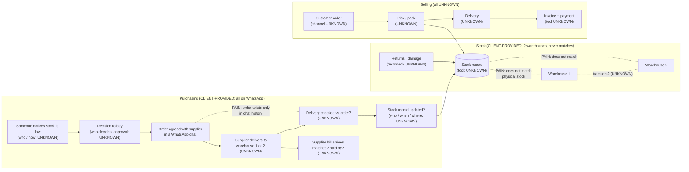

# Scenario B: Test Company B (wholesale distributor, 2 warehouses)

> ATLAS output at the first stage. TEST with FAKE data: nothing built, nothing connected, no web research, no message
> sent. The only source is the customer's first message:
> *"We're a wholesale distributor with 2 warehouses. Stock never matches and purchasing is all on WhatsApp."*
> Anything not in that sentence is UNKNOWN or an assumption to confirm. No numbers are invented anywhere below.

---

## 1. Discovery questions first

ATLAS does not design anything yet. The customer has named two symptoms. ATLAS needs to find out how stock and buying
work today, and whether a stock or accounting system already exists, before it picks any technology. That answer
decides whether ATLAS keeps or connects an existing system, or buys or builds one. (Questions go to the customer through John in
ATLAS's own name. In DISCOVERY MODE ATLAS may ask directly.)

### Ask now (1–3, plain words)
> "Thanks, that helps. Two warehouses, stock that never quite adds up, and buying done over WhatsApp is a very common
> setup, and it's fixable. A few quick questions so I understand how it works today:
> 1. **Where do you keep your stock numbers and send your invoices today?** In a system, Excel, or on paper?
> 2. **When goods come in or go out at each warehouse, who writes it down, and when?**
> 3. **Could you walk me through the last time you ran low on something?** Who noticed, how was the order sent to the
>    supplier, and how did you check what arrived?"

Why these three: Q1 decides KEEP/INTEGRATE vs BUY vs BUILD (the archetype's first trap is building stock features before
the ERP question is settled). Q2 goes to the most likely cause of the mismatch: stock moves that nobody records. Q3 uses one
real recent example (D3) to rebuild the whole buying flow (request, order, delivery, check) in one answer.

### Next questions (after those, 1–3 at a time, in priority order)
| # | Question (plain words) | What it tells ATLAS |
|---|---|---|
| 1 | "Do both warehouses hold stock you sell from? Do goods move between the two, and if so, how is that recorded?" | Multi-location stock + transfers (often where stock goes missing between records) |
| 2 | "How often do you count stock, and when the count doesn't match, what do you do with the difference?" | Count/reconciliation practice; whether adjustments have a reason and an approver |
| 3 | "Who decides what to buy, and does anyone have to approve a purchase before it goes to the supplier? Is there a spending limit?" | Procurement with approvals (ERP-LIKE criterion 2); thresholds come from the client |
| 4 | "When a supplier's bill arrives, how do you check it against what you ordered and what actually arrived?" | POs + receiving + bill matching (ERP-LIKE criterion 3) |
| 5 | "Roughly how many different products do you carry?" | Size of the stock list (for migration and tool fit). ATLAS asks; it never estimates |
| 6 | "What happens with returns and damaged goods? Who records them?" | A frequent unrecorded movement |
| 7 | "How do your customers place orders with you, and how do you deliver to them?" | Sales side (order → reserve → pick/pack → delivery → invoice), whether WhatsApp is also used for sales |
| 8 | "Do you import goods from overseas, or track batch numbers, expiry dates or serial numbers? Do you assemble or repack anything?" | ERP-LIKE criteria: landed cost, batch/serial, assembly |
| 9 | "Is everything under one company, or several companies whose figures you combine?" | ERP-LIKE criterion: financial consolidation |
| 10 | "Who works in each warehouse, who does the buying, and who handles accounts?" | Roles, departments, permissions |
| 11 | "If you could see one screen every morning about stock and buying, what would you want on it?" | KPIs with real management questions |
| 12 | "Which country do you operate in?" | Privacy/messaging rules (e.g. PDPA if Singapore). Not assumed |

Every 5–6 answers ATLAS plays back a short "So far I understand… did I get that right?" summary.

---

## 2. What ATLAS knows

| # | Fact | Label |
|---|---|---|
| 1 | The company is a wholesale distributor | CLIENT-PROVIDED |
| 2 | It has 2 warehouses | CLIENT-PROVIDED |
| 3 | "Stock never matches" (stock records and reality disagree; which records against what is unstated) | CLIENT-PROVIDED |
| 4 | "Purchasing is all on WhatsApp" | CLIENT-PROVIDED |
| 5 | Its customers are mainly other businesses (wholesale) | INFERENCE |
| 6 | Both warehouses hold stock | INFERENCE (from "2 warehouses" + stock problem) |
| 7 | There is some stock record (a system, a sheet or paper) that gets compared with physical stock | INFERENCE (to say "never matches", something must be compared) |
| 8 | Orders to suppliers are sent as WhatsApp messages, not as formal purchase orders from a system | INFERENCE |
| 9 | What was ordered lives in chat history, so checking deliveries and supplier bills against orders is hard | INFERENCE (not stated as a pain) |
| 10 | Company name, country, size, number of staff, departments | UNKNOWN |
| 11 | Existing software: stock, accounting, ERP, Excel, POS | UNKNOWN |
| 12 | Number of products (SKUs), suppliers, customers, orders, purchases | UNKNOWN |
| 13 | How stock in/out, transfers between warehouses, returns and damage are recorded, by whom, when | UNKNOWN |
| 14 | How often stock is counted and how big the differences are | UNKNOWN |
| 15 | Who decides purchases; approvals; spending limits | UNKNOWN |
| 16 | How deliveries from suppliers are checked; how supplier bills are matched and paid | UNKNOWN |
| 17 | How customers order (channel), delivery method, invoicing, payment collection | UNKNOWN |
| 18 | Imports / landed cost, batch or serial tracking, assembly, multiple legal entities | UNKNOWN |
| 19 | Whether WhatsApp is the normal app, the Business app or a platform; one number or several; who uses it | UNKNOWN |
| 20 | What management wants to see; what outcome the owner wants | UNKNOWN |

Discovery readiness (coverage tracker D9): **1 / 14**. Company is partly understood. Major problems are partly understood. Everything
else is open. The Final Discovery Check (D10) fails, so everything in section 7 is provisional.

---

## 3. Assumptions to confirm

1. Both warehouses hold sellable stock, and the company wants one stock figure per product per warehouse.
2. "Stock never matches" means the recorded stock differs from what is physically on the shelf (not, for example, two
   staff spreadsheets disagreeing with each other). ATLAS must confirm which comparison is meant.
3. Supplier orders are agreed in WhatsApp chats with no purchase order document or record outside the chat.
4. Goods from suppliers arrive into one or both warehouses and are checked (or not) by warehouse staff.
5. Supplier bills are paid by someone in the company after some check, which is unknown.
6. The owner wants to keep WhatsApp as the way to talk to suppliers. ATLAS will not take a channel away that works for
   them. Only the *record* of the order needs a home.
7. There is no manufacturing or assembly (typical of wholesale, but not stated).
8. The sales side (customer orders, delivery, invoicing, collections) is not currently reported as a problem.

None of these is used as a fact in the design. Each one is a question in section 1 or 8.

---

## 4. Knowledge used

Opened (and why):
| File | Why |
|---|---|
| `.claude/agents/atlas.md` (whole file, incl. BUSINESS SYSTEMS INTELLIGENCE (v3), B19, B20) | ATLAS's instructions, system-type rules, EDG Core catalog |
| `60_Skill_Packs/ATLAS_Business_Systems/00_Index.md` | Router: SYMPTOM → INVESTIGATE table. "Stock never matches" → investigate movements, who updates, returns/damage, POs, locations → **Inventory + Procurement** |
| `60_Skill_Packs/ATLAS_Business_Systems/13_Inventory_Warehouse.md` | Index trigger "Stock never matches"; signal "several warehouses" |
| `60_Skill_Packs/ATLAS_Business_Systems/14_Procurement.md` | Index trigger "Purchasing over WhatsApp" (exact signal) |
| `60_Skill_Packs/ATLAS_Business_Systems/Archetypes/Wholesale_Distribution.md` | Closest archetype: the customer said "wholesale distributor" |

Considered and **not** opened (trigger not met yet):
| File | Why not now | Opens when |
|---|---|---|
| `20_ERP_Intelligence.md` | Index trigger is 3+ ERP-LIKE items; only 1 is confirmed (section 6). The archetype lists it as a must-have, so it is the first card to open once discovery confirms the count | ≥3 ERP-LIKE criteria confirmed |
| `15_Logistics.md` | No delivery problem stated | Customers ask "where is my order?" / delivery issues |
| `08_Accounting_Finance.md`, `24_Payments.md` | No payment/invoice problem stated; accounting tool unknown | Q1 answer names an accounting tool or bill-matching pain |
| `17_WhatsApp_Messaging.md` | WhatsApp is used for *supplier* purchasing, not customer enquiries (card trigger) | Customers also order or enquire on WhatsApp |
| `04_Spreadsheet_Intelligence.md` | Excel not mentioned | Q1 answer is "Excel" |
| `28_Management_Dashboard.md`, `29_CEO_Daily_Brief.md` | Owner hasn't asked for visibility yet | Owner says "I can't see what's happening" or answers Q11 |
| `27_AI_Agent_Layer.md` | No high message volume stated | Volume of chats is stated as a problem |

---

## 5. System type

**Provisional: HYBRID (stock + purchasing operations). ERP-LIKE EDG is the leading hypothesis but is NOT confirmed.
1 of the 3 required criteria is confirmed.**

ERP-LIKE rule (agent file): ERP-LIKE when **3 or more** apply. Count:

| # | ERP-LIKE criterion | Status | Evidence |
|---|---|---|---|
| 1 | Multi-location stock | **CONFIRMED** | "2 warehouses" + "stock never matches" (confirm both hold sellable stock) |
| 2 | Procurement with approvals | PARTIAL, does not count | Purchasing exists (CLIENT-PROVIDED); approvals UNKNOWN |
| 3 | Purchase orders + receiving | UNKNOWN | "All on WhatsApp" suggests no formal POs; receiving process unknown |
| 4 | Manufacturing / assembly | UNKNOWN | Not typical for wholesale (INFERENCE), not stated |
| 5 | Landed cost | UNKNOWN | Imports not stated |
| 6 | Serial / batch tracking | UNKNOWN | Not stated |
| 7 | Financial consolidation | UNKNOWN | Number of entities not stated |
| 8 | Many integrated departments | UNKNOWN | Team and departments not stated |

**Confirmed: 1. Partial: 1. Unknown: 6. Needed: 3. The ERP-LIKE threshold is not met.**

The other types:
- SALES-CRM: no leads, deals or quotes mentioned. Does not fit the stated problem.
- FIELD-SERVICE EDG: no on-site work. Does not fit.
- PROJECT/OPS EDG: no long multi-step deliveries. Does not fit.
- COMMERCE EDG: stock is central, but online orders are not stated. Partial fit at most.

Why HYBRID for now: the stated problems sit in stock records and purchasing, and these are ERP-type
processes. There is not yet enough confirmed to call it ERP-LIKE. Card 13 KEEP/BUY/BUILD says: if ERP-LIKE applies, keep/integrate the
ERP or buy a mature one. Otherwise use a mature inventory product or an EDG module.
**Decision gate:** if discovery confirms criteria 2 and 3 (approvals; POs + receiving), the count reaches 3 and the type
becomes ERP-LIKE EDG. ATLAS then opens card 20 and evaluates KEEP/INTEGRATE an existing ERP or BUY a mature one before any custom
module. Either way, nothing is built until the stock/accounting question (Q1) is answered.

---

## 6. Provisional design (to confirm after discovery)

### 6.1 Current-state map (what is known; UNKNOWN steps marked)

### 6.2 Problem map
| # | Problem | Source | Where it likely starts (to investigate, not fact) | Impact |
|---|---|---|---|---|
| P1 | Stock records don't match reality | CLIENT-PROVIDED | Movements not recorded (receipts, sales, transfers, returns, damage); edits without a reason; records updated late; two warehouses, one or two records | Not quantified (the client gave no numbers). Ask Q2 and next-Q2 for "how far off" |
| P2 | Purchasing is done only in WhatsApp | CLIENT-PROVIDED | No purchase record outside chats. Possibly no approval step and no check of deliveries/bills against the order | Not quantified. INFERENCE: P2 feeds P1 (if receipts are not checked against an order, stock-in is wrong) |
| P3 | Hard to check what was ordered vs received vs billed | INFERENCE | Follows from P2 | To confirm (next-Q4) |

Rule: understand why stock breaks before automating anything (UNDERSTAND → SIMPLIFY → STRUCTURE → CONNECT → AUTOMATE).

### 6.3 KEEP / INTEGRATE / BUY / BUILD per area
| Area | Provisional call | Reason |
|---|---|---|
| **Stock records (both warehouses)** | **KEEP/INTEGRATE** an existing stock/ERP/accounting system if one exists. Otherwise **BUY** a mature inventory or ERP product. **Do not BUILD.** | Stock is mature software territory; "never rebuild mature ERP/accounting functionality without a strong reason". Fusion EDG Core has no inventory module (NEW BUILD). What is broken is mainly the *process* (movement-only recording), and a mature tool already enforces that. Which product: ATLAS compares 2–3 options after Q1 and Ryan decides. No vendor is named before discovery |
| **Purchasing (requests, approvals, POs, receiving)** | Same system as stock: **INTEGRATE** (if the existing system has purchasing) or **BUY** with it | Card 14: "usually part of the ERP or accounting software (integrate). Custom only for an unusual approval chain". Keeping POs and receiving in the same system as stock is what fixes P1 + P2 together |
| **WhatsApp with suppliers** | **KEEP** as the conversation channel | It works for the people who use it. Only the record of the order moves into the system (PO created there, then sent by WhatsApp or email) |
| **Accounting / supplier bills** | **KEEP** whatever exists (UNKNOWN) and **INTEGRATE** later | Accountant/human oversight preserved. No accounting advice. 3-way match only once POs and receipts are recorded |
| **Management view (stock + purchasing numbers)** | Later. **INTEGRATE**: Fusion EDG Core CEO Daily Brief reading from the stock system | Only after one source of truth for stock exists. The connector to that system is NEW BUILD |
| **Sales/CRM, customer WhatsApp, quotations, invoicing** | **Not needed now** | No problem stated there. Revisit after next-Q7 |

### 6.4 Minimum modules vs later / optional
**Minimum (solves the two stated problems, once confirmed):**
1. **One stock record for both warehouses**, per product and location. Stock changes only through movements (receipt,
   sale/issue, transfer between warehouses, adjustment with reason + approver). No silent edits.
2. **Opening stock count** in both warehouses to set a trusted starting figure (dry-run import, reconciliation counts,
   client sign-off before it becomes the live figure).
3. **Purchase orders + receiving**: every supplier order recorded as a PO (WhatsApp stays the way it's sent), receipts
   recorded against the PO (full/partial), stock updated from the receipt.

**Later / optional (only if discovery shows the need):**
- Purchase approvals with spending limits (thresholds: CLIENT TO DEFINE; requester ≠ approver)
- Periodic count → variance → approved adjustment routine
- Low-stock / reorder alerts → purchase request
- Supplier bill 3-way match (PO ↔ receipt ↔ bill) with the accounting tool
- Returns and damaged-stock recording
- Management dashboard / CEO Daily Brief on stock and purchasing
- AI assist: turn a supplier WhatsApp chat into a *draft* PO for a person to confirm (NEW BUILD)
- Sales side: customer orders, stock reservation, delivery tracking, collections (archetype flow), CRM, customer
  WhatsApp assistant. All depend on next-Q7

### 6.5 Per-process classification
| Process | Classification | Note |
|---|---|---|
| Recording goods in / out at each warehouse | **REDESIGN** + **AUTOMATE** | Movement-only. Sales/issues and receipts post movements automatically in the system |
| Transfers between the 2 warehouses | **REDESIGN** | Recorded as a transfer (out of one, into the other), never as two separate manual edits |
| Stock adjustments | **KEEP HUMAN** | Reason + approver required |
| Physical stock counts | **KEEP HUMAN** (counting) + **AUTOMATE** (variance report) | |
| Deciding what to buy | **KEEP HUMAN** (+ **AI ASSIST** later: low-stock suggestions) | |
| Approving purchases | **KEEP HUMAN** | Thresholds from the client |
| Sending the order to the supplier | **REDESIGN** | PO created in the system first, then sent (WhatsApp/email). PO document generated automatically |
| Talking with suppliers on WhatsApp | **KEEP HUMAN** (+ **AI ASSIST** later: chat → draft PO, NEW BUILD) | Channel kept |
| Receiving deliveries | **KEEP HUMAN** check, **REDESIGN** to record against the PO | Full/partial receipt |
| Matching supplier bills | **AUTOMATE** flagging (3-way match) + **KEEP HUMAN** decision | Later, depends on accounting tool |
| Paying suppliers | **KEEP HUMAN** | High-impact financial action (L5) |
| Re-typing orders from chats into records (if it happens) | **REMOVE** | UNKNOWN whether this happens today |
| AI AGENT | **None justified yet** | No high message volume or repeated conversation load stated |

### 6.6 Fusion EDG Core today vs NEW BUILD (agent file B19 catalog)
| Need | EDG Core today | Status |
|---|---|---|
| Inventory / stock movements / multi-warehouse | Not in the catalog | **NEW BUILD**. Recommended route is KEEP/INTEGRATE/BUY instead, so this is not built |
| Procurement / POs / receiving | Not in the catalog | **NEW BUILD**. Same recommendation: in the stock system |
| Stock-system connector (read stock + purchase data) | Not in the catalog | **NEW BUILD** (only after the system is chosen; its official API docs are checked first, with URL + date) |
| CEO Daily Brief + KPIs | In the catalog: numbers from SQL only, "data unavailable" when a source is missing | **TESTED, staging**. Usable only once the connector feeds it (later) |
| Accounting (Xero) | In the catalog: push invoices, payments come back | **TESTED (MOCK); live NEEDS VERIFICATION**. Relevant only if the client uses Xero (UNKNOWN). QuickBooks is NEW BUILD |
| WhatsApp chat → draft PO | B20 tool catalog has no purchasing tools | **NEW BUILD** (optional, later) |
| Client WhatsApp number / Lead intake + CRM / Quotations / Invoices + payments / Appointments | In the catalog | Not needed for the stated problems. Archetype notes EDG Core "sits beside the ERP" for enquiries/CRM/brief if sales-side needs appear |

### 6.7 KPIs (each answers a named management question; values only from connected data; no targets until the client sets them)
| KPI | Management question | Definition (plain) | Phase |
|---|---|---|---|
| Stock accuracy per warehouse | *Can we trust the stock numbers in each warehouse?* | Counted quantity vs system quantity at each count, per warehouse | Minimum |
| Adjustments with no reason / approver | *Is stock being corrected without anyone being accountable?* | Count of adjustments missing a reason or approver (should be zero by design) | Minimum |
| Purchases received without a PO | *Is any buying still happening only in WhatsApp?* | Receipts not linked to a recorded PO | Minimum |
| Short / partial deliveries by supplier | *Which suppliers deliver less than we ordered?* | Receipts where received quantity is below the PO quantity | Minimum |
| Stock-outs | *Are we losing sales because we ran out?* | Products at zero available stock, per warehouse | Later |
| Supplier on-time delivery | *Which suppliers let us down?* | Receipts on or before the agreed date ÷ all receipts | Later (needs agreed dates on POs) |
| Bills not matched | *Are we paying for what we did not receive?* | Supplier bills failing PO ↔ receipt ↔ bill match | Later (needs accounting link) |
| Value of slow-moving stock | *Where is our cash stuck?* | Stock value with no movement over a period the client defines | Later |
| Fill rate, days to collect payment (DSO) | *Do customers get what they order? How fast do we get paid?* | Archetype signature KPIs | Only if the sales side is in scope (next-Q7) |

---

## 7. Report to John

**In plain words (for John):**
Test Company B is a wholesale distributor with two warehouses. Two things hurt: their stock figures never match what
is really on the shelves, and all buying from suppliers happens in WhatsApp chats. Nothing else is known yet.
These two problems are usually connected. When orders and deliveries live only in chats, goods come in without being
checked or recorded properly, so stock drifts. The likely fix is a process fix first: one stock list for both
warehouses, every movement recorded (goods in, goods out, moves between warehouses, corrections with a reason), and
every supplier order recorded before it's sent. WhatsApp stays. This is normally handled by an existing stock or
accounting system they may already have, or by a ready-made product. We would connect it rather than build it from
scratch. We can't say which until we know what software they use today. Please don't suggest any product, price or
timeline to the customer yet.

**Questions for John to ask now (in this order, 1–3 at a time):**
1. "Where do you keep your stock numbers and send your invoices today? In a system, Excel, or on paper?"
2. "When goods come in or go out at each warehouse, who writes it down, and when?"
3. "Could you walk me through the last time you ran low on something? Who noticed, how was the order sent to the
   supplier, and how did you check what arrived?"

**Then (after their answers):**
4. "Do both warehouses hold stock you sell from? Do goods move between them, and how is that recorded?"
5. "How often do you count stock, and what do you do when the count doesn't match?"
6. "Who decides what to buy, and does anyone approve a purchase before it goes out? Is there a spending limit?"
7. "When a supplier's bill arrives, how do you check it against what you ordered and received?"

**Build status:** nothing built. Design is provisional, readiness 1/14. Checkpoint 1 (company model + current state +
problem map) cannot be confirmed until discovery answers come back.

---

## 8. Items for Ryan
1. **Pricing:** never quoted. FusionTech fee and any third-party software/licence costs are separate and go to Ryan.
2. **Timeline / delivery dates:** never quoted. Depends on the Q1 answer (connect existing vs buy new) and the size of
   the stock list.
3. **Software choice:** if they need a new stock/ERP product, ATLAS will compare 2–3 options (fit, WhatsApp/API,
   cost per user, local support/data location, ease of use, lock-in). **Ryan decides.** No vendor named yet.
4. **NEW BUILD scope:** inventory and procurement are not in Fusion EDG Core. Ryan decides whether FusionTech ever
   offers them, or (ATLAS's recommendation) integrates/buys instead.
5. **Opening stock count + data migration:** customer effort and FusionTech effort to be scoped by Ryan once the
   product count is known.
6. **Approval thresholds** for purchases and stock adjustments: from the client, not assumed.
7. **Jurisdiction / privacy:** country unknown. If Singapore, PDPA applies; flag for human review.
8. **Checkpoint 1 confirmation** after discovery: company model, current state, problem map.
