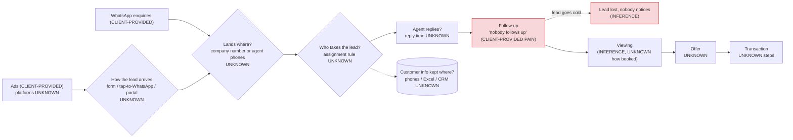

# Scenario C · Property agency, 20 agents, "nobody follows up"

> TEST with FAKE data. Nothing was built or connected, no web research was done and nobody was messaged. The only
> input is the customer's first message:
> *"I'm a property agency with 20 agents. Leads come from ads and WhatsApp, and nobody follows up."*
> Everything else below is labelled INFERENCE, UNKNOWN or an assumption to confirm. No numbers were invented.

---

## 1. Discovery questions first

ATLAS is in DESIGN MODE, but the Final Discovery Check (agent file D10) fails on almost every line. So the design in
section 7 is **provisional**, and the first job is to ask. The customer's line matches the playbook row "My
salespeople aren't following up" (D3). Following the D8 rule for a stated pain, ATLAS asks for a real example before
offering a fix.

### Ask now (one message, 3 questions)
> "Thanks, that's a very common headache for agencies, and it's fixable. To make sure we fix the right thing:
> 1. When a new enquiry comes in from an ad or on WhatsApp, where does it land first: a company number or inbox, or
>    straight on an agent's own phone? And how is it decided which agent takes it?
> 2. Think of a recent lead that went cold. What happened to it, and how did you find out nobody had followed up?
> 3. Roughly how many new enquiries do you get in a month?"

Why these three: (1) tells ATLAS whether leads have an owner and where the data lives (the archetype's biggest
trap: leads on personal phones); (2) shows where follow-up actually breaks, in the customer's own story;
(3) sizes the solution (how much can be automated, whether an AI first-reply assistant is worth it).

### Next questions (after those answers), in priority order
Each answer decides the next one; ATLAS asks 1–3 at a time, never the whole list.

| # | Question (plain words) | Why ATLAS needs it |
|---|---|---|
| 1 | "Who pays for the ads: the agency or each agent? And should a lead go to the agent whose ad or listing it came from, or be shared out fairly?" | Decides the assignment rule (round-robin vs ad-owner vs area). Wrong rule = agents ignore the system. |
| 2 | "Which ads do you run, and what does someone do after they see one: fill in a form, tap to WhatsApp you, or contact you on a property portal?" | Decides the intake paths and whether each source can be tracked automatically. |
| 3 | "Are you using normal WhatsApp, the WhatsApp Business app, or a platform like Respond.io? Is there one company number, or does each agent use their own?" | Decides the WhatsApp design (card 17) and whether chats can reach one customer list at all. |
| 4 | "What kind of deals do your agents mostly handle: buying, selling, renting? Homes, commercial, new launches?" | The pipeline stages and the details a lead needs differ by deal type. |
| 5 | "How quickly should a new enquiry get a reply, and who should be told when a follow-up is late: the agent, a team leader, you?" | Sets the reply time and escalation (SLA) instead of ATLAS guessing it. |
| 6 | "Where is customer information kept today: agents' phones, Excel or Google Sheets, a CRM, a portal tool?" | Tools inventory (D6): KEEP / CONNECT / MIGRATE decision. |
| 7 | "What happens after someone is interested: how are viewings arranged, and whose calendar are they in?" | Confirms whether viewing bookings belong in the first slice. |
| 8 | "If you opened one screen every morning, what would you want to see about your agents and leads?" | Management view; every number must answer a question the owner actually asks. |
| 9 | "Are the 20 agents your employees, or registered agents working under your agency? If an agent leaves, who keeps their customers?" | Data ownership and who may see which leads. |
| 10 | "Do you also call or SMS people who did not contact you first, or send them promotions?" | Decides whether Do Not Call checks are needed (section 7.4). |
| 11 | "Is the agency in Singapore?" (ask only if not already obvious from the conversation) | The compliance notes below assume Singapore. |

---

## 2. What ATLAS knows

| # | Fact | Label |
|---|---|---|
| K1 | The company is a property agency. | CLIENT-PROVIDED |
| K2 | It has 20 agents. | CLIENT-PROVIDED |
| K3 | Leads come from ads. | CLIENT-PROVIDED |
| K4 | Leads come from WhatsApp. | CLIENT-PROVIDED |
| K5 | "Nobody follows up" (the stated main pain). | CLIENT-PROVIDED |
| K6 | It is mostly a leads → viewings → offers → transactions business, so a sales CRM fits. | INFERENCE (property archetype) |
| K7 | More than one person sells, so lead ownership and assignment matter. | INFERENCE (from K2) |
| K8 | Viewings are part of the sales process. | INFERENCE (archetype core flow; not said) |
| K9 | Some or all leads may sit on agents' personal phones or WhatsApp. | INFERENCE (archetype trap; not said) |
| K10 | Management cannot easily see whether follow-up happened (otherwise "nobody follows up" would be caught earlier). | INFERENCE (from K5) |
| K11 | The lead source per deal is probably not tracked today. | INFERENCE (to confirm) |
| K12 | The agency is in Singapore. | UNKNOWN (FusionTech is Singapore-based; the customer did not say) |
| K13 | Company name, website, social pages. | UNKNOWN |
| K14 | Number of enquiries per month, per source. | UNKNOWN |
| K15 | Which ad platforms; form vs click-to-WhatsApp vs property portal. | UNKNOWN |
| K16 | WhatsApp setup (normal / Business app / platform; company number vs personal numbers). | UNKNOWN |
| K17 | How leads are assigned today. | UNKNOWN |
| K18 | Current tools for customer data (Excel, CRM, portal tools, phones). | UNKNOWN |
| K19 | Team structure: team leaders/managers, who escalations go to. | UNKNOWN |
| K20 | Deal types (sale / rent, residential / commercial, new launch / resale). | UNKNOWN |
| K21 | Current reply time; the target reply time. | UNKNOWN |
| K22 | How viewings are booked and recorded. | UNKNOWN |
| K23 | What happens after an offer (transaction steps, commission handling). | UNKNOWN |
| K24 | What management wants to see each day. | UNKNOWN |
| K25 | Whether agents are employees or registered agents under the agency; who owns the customer data. | UNKNOWN |
| K26 | How consent is collected in ads and forms; whether they call/SMS people who did not enquire. | UNKNOWN |
| K27 | Budget and timeline expectations. | UNKNOWN (and never quoted by ATLAS) |

Coverage tracker (D9): company ◐ · customers ☐ · products/services ◐ · lead sources ◐ · sales process ☐ ·
follow-up process ☐ · customer service ☐ · operations ☐ · accounting/payment ☐ · existing software ☐ ·
employees/roles ◐ · management requirements ☐ · major problems ◐ · desired outcome ☐.
(◐ = partly known; nothing is fully understood yet.)

---

## 3. Assumptions to confirm

| # | Assumption | Why it matters | Confirm by |
|---|---|---|---|
| A1 | The agency operates in Singapore. | All compliance notes (CEA, PDPA, DNC) depend on it. | Next-questions #11 |
| A2 | "Ads" means social or search ads (and maybe property portals), not print. | Decides the intake paths and tracking. | Next-questions #2 |
| A3 | The main deals involve viewings before an offer. | Decides whether viewing booking is in the first slice. | Next-questions #7 |
| A4 | Each lead should belong to one agent at a time. | "No lead without an owner" rule. | First questions #1, next #1 |
| A5 | There is someone above the agents (owner, team leader) who should see late follow-ups. | Escalation path. | Next-questions #5 |
| A6 | The agency wants enquiries on a company-owned WhatsApp number, not only agents' personal numbers. | Without it, WhatsApp chats can't reach a shared customer list, and the agency loses leads when agents leave. | Next-questions #3, #9 |
| A7 | No quotations, invoices or payments need to be handled in this system. | Keeps quotes/invoices/Xero out of scope. | Next-questions #4 and the post-offer flow |
| A8 | Follow-up here means replying to people who enquired (service messages), not cold marketing. | Decides whether DNC checks are needed. | Next-questions #10 |
| A9 | The agents will use a shared system if it saves them work. | Adoption risk with 20 people. | After the first playback summary |

---

## 4. Knowledge used

| File opened | Why |
|---|---|
| `.claude/agents/atlas.md` (all, incl. BUSINESS SYSTEMS INTELLIGENCE v3, B19, B20) | ATLAS's instructions, system-type rules, module catalog, client AI-team catalog. |
| `60_Skill_Packs/ATLAS_Business_Systems/00_Index.md` | Pack router; SYMPTOM → INVESTIGATE row "Leads go missing" → Sales + Follow-Up. |
| `…/Archetypes/Property_Agency.md` | Closest archetype: core flow, must-have cards, traps, signature KPIs. |
| `…/01_Sales_CRM.md` | Enquiries arrive in several places (ads + WhatsApp); pipeline default, lost reasons, KPIs. |
| `…/02_Follow_Up.md` | "Nobody follows up": owner / next action / next action date, DETECT list, escalation, follow-up KPIs. |
| `…/17_WhatsApp_Messaging.md` | WhatsApp is a stated lead source; 24 h window, templates, opt-in, company-owned number. |
| `…/06_Calendar_Appointments.md` | Must-have card of the archetype (viewings). Opened, but used only as a provisional module (A3). |
| `…/22_Forms.md` | Must-have card of the archetype (ad lead forms); consent captured with the submission. |
| `…/28_Management_Dashboard.md` | Must-have card of the archetype; "nobody follows up" can only be fixed if someone sees it. |
| `70_Industry_Packs/Singapore_Property/00_Index.md` | Linked from the archetype; finds the compliance notes. |
| `70_Industry_Packs/Singapore_Property/05_Marketing_Advertising_Rules.md` | CEA ad rules (linked from the archetype's traps). |
| `70_Industry_Packs/Singapore_Property/03_Regulation_Register.md` | Sources for CEA (R29, R30) and DNC (R37) rows, with verified dates. |
| `Open loops.md` (one line, via search) | Card 02 points to the known scheduler gap on the test system. |

Not opened (not signalled yet): 05 Documents (no quotes mentioned), 08 Accounting, 24 Payments, 04 Spreadsheet (no
Excel mentioned), 27 AI Agent Layer (volume unknown), 29 CEO Daily Brief, 20 ERP. Opened when discovery signals them.

---

## 5. System type

**SALES-CRM** (provisional).

Reason, using the agent file's SYSTEM-TYPE DECISION RULES:
- The stated business is leads (ads, WhatsApp) → follow-up → deals: "mostly leads → deals → won" = SALES-CRM.
- Viewings happen on site, but they are sales appointments, not delivered work with job cards and completion proof,
  so it is not FIELD-SERVICE EDG.
- No online orders or stock (not COMMERCE). ERP-LIKE needs 3+ of the listed items; 0 are known.
- The archetype's likely type is also SALES-CRM.
- Could change to HYBRID (SALES-CRM + PROJECT/OPS) only if the agency wants the post-offer transaction steps tracked
  as multi-step work. That is UNKNOWN (K23).

---

## 6. Provisional design (to confirm after discovery)

### 6.1 Current-state map (most steps UNKNOWN)

### 6.2 Problem map
Impact is described in words only; the customer gave no numbers.

| # | Problem | Label | Where it occurs | Impact (plain words) |
|---|---|---|---|---|
| P1 | Leads are not followed up. | CLIENT-PROVIDED | After first contact | Paid ad leads and WhatsApp enquiries go cold; money spent on ads is wasted. |
| P2 | Leads may have no clear owner. | INFERENCE | Assignment | When everyone could reply, nobody does. |
| P3 | Nobody sees which follow-ups are late. | INFERENCE | Management | The problem is found only after the lead is lost. |
| P4 | Lead data may sit on agents' personal phones. | INFERENCE (archetype trap) | WhatsApp | The agency can't see the chats, and loses the customers when an agent leaves. |
| P5 | Ad and WhatsApp leads for the same person may be recorded twice, or not at all. | INFERENCE | Intake | Double contact or missed contact; unclear which ads work. |
| P6 | Which ads bring actual deals is probably not known. | INFERENCE | Attribution | Ad budget can't be steered to what works. |

### 6.3 Property pipeline (provisional, from the archetype "lead → viewing → follow-up → offer → transaction")
Rules for every stage: an active lead always has OWNER • STATUS • LAST INTERACTION • NEXT ACTION • NEXT ACTION DATE.
No lead without an owner. WON / LOST is set by a person; a LOST reason is required.

| Stage | Entry condition | Owner | Follow-up rule (B20 catalog terms) | SLA | Exit | Escalation |
|---|---|---|---|---|---|---|
| NEW LEAD | `lead.created` from an ad form, tap-to-WhatsApp or WhatsApp message; source recorded; deduplicated against existing contacts | System → agent by assignment rule [CLIENT TO DEFINE] | Immediate acknowledgement (`message_customer` or the AI assistant). If no agent can be assigned → `notify_owner` | First reply within [CLIENT TO DEFINE] | Agent has replied → CONTACTED | Unassigned or unanswered after [CLIENT TO DEFINE] → manager [CLIENT TO DEFINE] |
| CONTACTED | Agent (or AI assistant) has exchanged messages with the customer | Assigned agent | `customer_has_not_replied` → `ai_follow_up` (with `fallback_text`) or `create_task` for the agent; cap on automatic reminders [CLIENT TO DEFINE] | Next action set within [CLIENT TO DEFINE] | Needs known → QUALIFIED; or LOST | No next action date, or overdue → agent, then manager after [CLIENT TO DEFINE] |
| QUALIFIED | Basic needs recorded: buy / sell / rent, property type, area, timing (fields [CLIENT TO DEFINE]) | Assigned agent | `lead_still_open` and no viewing booked → `create_task` | [CLIENT TO DEFINE] | Viewing booked → VIEWING BOOKED; not ready yet → NURTURE (optional); or LOST | Stalled for [CLIENT TO DEFINE] → manager |
| VIEWING BOOKED *(if A3 confirmed)* | `appointment.booked` | Assigned agent | Reminder before the viewing (24 h reminder exists in EDG Core); after the viewing, the agent records completed / no-show | — | `appointment.completed` → VIEWING DONE; `appointment.no_show` → back to CONTACTED with a recovery task | No-show → agent task; repeat no-show → [CLIENT TO DEFINE] |
| VIEWING DONE | Agent marks the viewing completed | Assigned agent | `create_task` "post-viewing follow-up"; `customer_has_not_replied` → reminder to the agent | Post-viewing follow-up within [CLIENT TO DEFINE] | Customer wants to offer → OFFER; wants more viewings → back to QUALIFIED; or LOST | Overdue → manager |
| OFFER / NEGOTIATION | Agent records that an offer is being made | Assigned agent (human only; no AI messaging on price) | `lead_still_open` → reminder to the agent only | [CLIENT TO DEFINE] | Agent marks WON or LOST | Stalled → manager |
| NURTURE *(optional, to confirm)* | Customer not ready yet; customer agreed to be contacted later | Assigned agent | Scheduled task for the agent on the date the customer gave. Any promotional message needs consent (section 6.4) | [CLIENT TO DEFINE] | Customer re-engages → QUALIFIED; opts out → LOST (reason "opted out") | — |
| WON *(transaction)* | Set by a person only | Agent / manager | Post-transaction steps UNKNOWN (K23) | — | — | — |
| LOST | Set by a person only; reason required | Agent / manager | None. Opt-outs are respected everywhere | — | — | — |

LOST reasons picklist: **draft for the client to confirm**: no response · bought / rented elsewhere · not ready ·
needs not matched · chose another agent · opted out · duplicate / invalid. Final list [CLIENT TO DEFINE].
Scoring: not designed yet; card 01 says lead scoring only "with enough data".

### 6.4 Compliance notes (for human/legal review, NOT legal advice)
Everything here assumes **Singapore (A1, not confirmed)**. If the agency is elsewhere, these notes don't apply and
that country's rules must be checked instead.

| # | Note | Source in the vault | Status |
|---|---|---|---|
| C1 | **CEA, contact hours:** no SMS ads or cold calls 10pm–9am. Automatic calls/SMS from the follow-up engine must respect this. Whether this hour rule also covers WhatsApp follow-up messages is not stated in the register. | Regulation Register R29 (CEA PG 02-11) | R29 VERIFIED 2026-09-30. WhatsApp coverage: **NEEDS VERIFICATION** |
| C2 | **CEA, ad content:** agent ads must show the agency's and agent's name and CEA-registered contact number, the agency's licence number and the agent's registration number; owner's prior written consent before advertising; no misleading photos. This is ad content, so it belongs to the Marketing Agent (not ATLAS). ATLAS only records the lead source. | R29, R30; `05_Marketing_Advertising_Rules.md` | VERIFIED 2026-09-30. Handoff to [[10_Agents/03_Marketing_Growth]] (draft, not built) |
| C3 | **CEA, other duties** (for example rules on how agents handle and record leads, or on the agency's duty to supervise agents' messaging): not in the vault. | none | **NEEDS VERIFICATION**; do not tell the customer anything about it yet |
| C4 | **PDPA, consent:** ad forms and WhatsApp intake collect personal data. Card 22 requires collecting only what's needed, with consent recorded with the submission. The exact PDPA consent and notification wording is not in the register. | Card 22, card 17, agent file §22 | **NEEDS VERIFICATION** (human/legal review) |
| C5 | **DNC:** check the DNC Registry within 21 days before sending a marketing call, SMS or fax to a Singapore number, unless there is clear consent or an ongoing relationship; withdrawals honoured within 21 days. Matters if the agency calls/SMSes people who did not enquire, or sends promotions (A8). Whether WhatsApp messages and replies to an enquiry fall under DNC is not stated in the register. | R37 (PDPC) | R37 VERIFIED 2026-09-30. WhatsApp / enquiry-reply coverage: **NEEDS VERIFICATION** |
| C6 | **WhatsApp platform rules:** messages more than 24 h after the customer's last message need an approved template, otherwise a person sends them. Ad-form leads have not messaged on WhatsApp yet, so the first WhatsApp message to them is outside the window (template + opt-in). Current Meta rules and pricing must be checked before promising. | Agent file §8, B20; card 17 | **UNVERIFIED** (doc check needed in BUILD) |
| C7 | **Data ownership:** if chats live on agents' personal phones, the agency may not hold the customer record. Who owns the customer data between agency and agent is a business/contract matter for the client. | Archetype trap | Client decision; flag for review |
| C8 | Opt-out respected everywhere; cap on automatic reminders per customer. | Card 02, card 17 | Design rule |

### 6.5 Minimum modules vs later / optional
Every module traces to a stated requirement.

**Minimum (first sellable slice, provisional):**
| Module | Solves | Trace |
|---|---|---|
| Lead intake from ads + WhatsApp → one customer list (dedupe, source recorded) | P5, P6 | K3, K4 |
| Lead owner + next action on every lead (assignment rule [CLIENT TO DEFINE]) | P2 | K2, K5 |
| Follow-up engine: detect unanswered, overdue, unassigned, stalled → remind agent → escalate to manager | P1, P3 | K5 |
| Company WhatsApp number connected to the customer list, with human takeover | P4 | K4 |
| Manager view: late follow-ups per agent, reply time, leads without a next action | P3 | K5 |

**Probable, include once confirmed:**
- Viewing bookings + reminders + calendar (A3).
- AI first-reply assistant on WhatsApp (decide after volume K14 is known; see 6.6).

**Later / optional:**
- Source → deal reporting by ad/campaign (needs ad tracking set up with the Marketing Agent).
- Daily brief to the owner (CEO Daily Brief).
- Nurture stage and long-term reminders.
- Property portal intake (each portal's lead delivery must be checked first).
- Post-offer transaction tracking (only if K23 shows multi-step work; may move the type to HYBRID).

**Not needed (unless discovery says otherwise):** quotations, invoices, payments, accounting (Xero), inventory, ERP.

### 6.6 Process classification
| Process | Decision | Note |
|---|---|---|
| Capture ad leads into one list | AUTOMATE | Source recorded at intake. |
| Capture WhatsApp enquiries | AUTOMATE | Needs a company number (A6). |
| Link the same person across ad and WhatsApp | AUTOMATE | Exact phone/email match → auto-link; partial match → review queue, never auto-merge. |
| Assign each lead to an agent | AUTOMATE | Rule from the client (round-robin, ad owner, area). |
| Leads kept on personal phones / private lists | REDESIGN | If confirmed (K9): move to a company number and shared list. |
| First reply to a new enquiry | AI AGENT | Instant acknowledgement + basic needs; hands over to the agent. Human takeover always. |
| Collect basic needs (buy/rent, type, area, timing) | AI ASSIST | AI collects; the agent checks. |
| Detect late follow-ups, remind, escalate | AUTOMATE | Scheduled checks (card 02 DETECT list). |
| Follow-up conversations about properties | KEEP HUMAN (+ AI ASSIST drafts) | Agents' relationship work. |
| Book viewings | AI ASSIST / AUTOMATE | Only if A3 is confirmed. |
| Viewings, negotiation, offers | KEEP HUMAN | |
| Prices, valuations, loans, stamp duty, eligibility questions | KEEP HUMAN | AI never answers these; hands over. |
| WON / LOST | KEEP HUMAN | Required lost reason. |
| Manual chasing by the owner ("did you call them back?") | REMOVE | Replaced by the manager view and alerts. |
| Ad campaigns and creative | Not ATLAS | Marketing Agent; ATLAS only records the source. |

Provisional AI assistant (B20): **purpose** reply instantly to new enquiries, collect basic needs, offer a viewing
slot or hand to the agent; **voice** [CLIENT TO DEFINE]; **channel** WhatsApp; **tools** `save_customer_details`,
`add_note`, `hand_over_to_person` (always), plus `find_free_times` and `book_job` (for viewings) only if A3 is
confirmed; `prepare_quote` NOT used. **Hand over** on prices, valuations, money, legal questions, complaints, and
anything the client names. It never invents a price, approves anything or marks WON / LOST.

Existing systems (D6): all UNKNOWN. Provisional: WhatsApp → CONNECT (type TBD); ad platforms → CONNECT (lead data
only); any CRM or spreadsheet → decided after K18.

### 6.7 What Fusion EDG Core can do today vs NEW BUILD
Status words exactly as in the agent file's B19 / cards.

| Need | Fusion EDG Core today | Status / gap |
|---|---|---|
| WhatsApp / web enquiry → one contact (dedupe) → owner by round-robin → next action → follow-up | Lead intake + CRM | TESTED, staging |
| Ad landing-page web form into intake | Web intake | TESTED |
| Meta lead-form ads (form inside the ad) into intake | not in the catalog | **NEW BUILD** (n8n adapter; API UNVERIFIED) |
| Tap-to-WhatsApp ads, tagged with which ad they came from | WhatsApp intake covers the message | Ad tag: **NEEDS VERIFICATION** (doc check) |
| Property portal leads | not in the catalog | **NEW BUILD**, per portal, after checking how each delivers leads |
| Assignment by ad owner / area instead of round-robin | round-robin only | **NEW BUILD** (if the client needs it) |
| Follow-up conditions and actions (`customer_has_not_replied`, `lead_still_open`, `notify_owner`, `ai_follow_up`, `create_task`) | Workflow engine | TESTED, staging. Known gap: the test system's scheduler runs once a day; live needs a proper scheduler (Open loops) |
| Escalation to a manager separate from the lead's agent | not confirmed in the catalog | **NEEDS VERIFICATION**, else **NEW BUILD** |
| Company WhatsApp number | Client WhatsApp number | TESTED (MOCK); live NEEDS VERIFICATION |
| Several WhatsApp numbers for one agency (per agent) | not confirmed | **NEEDS VERIFICATION** / possibly **NEW BUILD** |
| Viewing bookings, no double booking, 24 h reminders | Appointments | TESTED |
| Agents' Google calendars | Calendar (Google) | TESTED (MOCK); live NEEDS VERIFICATION. Outlook: NEW BUILD |
| AI first-reply assistant with the B20 tool catalog | Client AI team | TESTED on FAKE data (archetype) |
| Manager view / KPIs from SQL | Staff app "Today" report, KPIs | TESTED, staging |
| Owner's daily brief | CEO Daily Brief | TESTED, staging |
| 20 agents each seeing only their own leads, with proper logins | Staff app uses one-time sign-in links; proper logins not built | **NEW BUILD** / gap to flag to Ryan |
| Quiet-hours rule for calls/SMS (C1) | `after_hours` trigger variants exist | Enforcement as a hard rule: **NEEDS VERIFICATION** |
| DNC Registry check (C5) | not in the catalog | **NEW BUILD**, only if outbound marketing calls/SMS are in scope |
| Opt-out record respected by all workflows | not confirmed in the catalog | **NEEDS VERIFICATION** |

### 6.8 KPIs (each answers a management question; targets [CLIENT TO DEFINE])
| KPI | Management question | Source |
|---|---|---|
| Median first-reply time (by source, by agent) | Are we fast enough when a lead comes in? | Cards 01, 02, 17 |
| Overdue follow-ups per agent | Who is falling behind? | Card 02 |
| % of open leads with a next action date | Is anything slipping through? | Card 02 |
| Leads without a next action, per agent | Which agent's leads are drifting? | Archetype |
| Unassigned leads right now | Is any lead sitting with nobody? | Card 02 DETECT |
| Viewings per lead *(if A3 confirmed)* | Are leads turning into viewings? | Archetype |
| Conversion by source (lead → viewing → won) | Which ads or channels bring real deals? | Card 01 |
| Lost deals by reason | Why do we lose? | Card 01 |
| Chats handed to a person *(if AI assistant)* | What can the AI not handle? | Card 17 |

All values come from queries on connected data only; "data unavailable" when a source is down.

---

## 7. Report to John

**In plain words.** This is a property agency with 20 agents. Leads come from ads and WhatsApp, and the owner says
nobody follows up. That is all we know so far. It looks like a sales follow-up problem: every lead needs one
responsible agent, a next step with a date, a reminder when it's late, and a manager who can see who is behind.
FusionTech's existing system already covers most of that in testing. But before we recommend anything, we need to
know where leads land today (company number or agents' own phones), how they're shared out, and a real example of
a lead that went cold. No prices, timelines or promises yet. Our team sends a proposal once we understand the setup.

**Ask the customer now (send together):**
1. "When a new enquiry comes in from an ad or on WhatsApp, where does it land first: a company number or inbox, or
   straight on an agent's own phone? And how is it decided which agent takes it?"
2. "Think of a recent lead that went cold. What happened to it, and how did you find out nobody had followed up?"
3. "Roughly how many new enquiries do you get in a month?"

**Then, one to three at a time, depending on the answers:**
4. "Who pays for the ads: the agency or each agent? Should a lead go to the agent whose ad it came from, or be
   shared out fairly?"
5. "Which ads do you run, and what does someone do after seeing one: fill in a form, tap to WhatsApp you, or contact
   you on a property portal?"
6. "Do you use normal WhatsApp, the WhatsApp Business app, or a platform like Respond.io? One company number, or each
   agent's own?"
7. "What kind of deals do your agents mostly handle: buying, selling, renting? Homes or commercial?"
8. "How quickly should a new enquiry get a reply, and who should be told when a follow-up is late?"
9. "Where is customer information kept today?"
10. "How are viewings arranged, and whose calendar are they in?"
11. "If you opened one screen every morning, what would you want to see about your agents and leads?"

**Don't say yet:** anything about cost or timing, anything about CEA / PDPA / DNC rules, or that something will
"definitely" work with their WhatsApp or ad setup. If they ask whether their data is safe, use the standard
answer (agent file D3) and pass the concern to ATLAS.

**Build status:** nothing built. Design is provisional; discovery readiness 0/14 (4 partly known).

---

## 8. Items for Ryan

| # | Item | Why |
|---|---|---|
| R1 | Pricing and proposal scope | Never quoted by ATLAS or John. |
| R2 | Timeline | Never quoted. |
| R3 | Is the agency in Singapore, and does FusionTech take non-Singapore clients? | Compliance basis (A1). |
| R4 | Legal/human review of C1, C3, C4, C5: whether CEA hours and DNC cover WhatsApp follow-ups and enquiry replies; PDPA consent wording for ad forms | Not in the vault; marked NEEDS VERIFICATION. |
| R5 | Capability gaps before promising: proper staff logins with per-agent visibility; several WhatsApp numbers per client; manager escalation; Meta lead-form intake; a live scheduler that runs more often than once a day | NEW BUILD / NEEDS VERIFICATION items in 6.7. |
| R6 | Whether the Marketing Agent (draft, not built) or Ryan handles ad tracking (UTM / ad tags) and CEA ad-content checks | ATLAS records sources only; campaigns are not ATLAS's. |
| R7 | Checkpoint 1 approval once discovery answers arrive: company model + current state + problem map | Agent file CHECKPOINTS. |
| R8 | Client-side decisions to collect: assignment rule, reply time, escalation person and delay, lost reasons, reminder cap, data ownership between agency and agents | All [CLIENT TO DEFINE]. |
