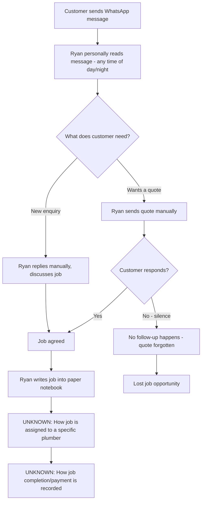

# Current state — Ah Kow Plumbing

# Current State — Ah Kow Plumbing

## Narrative
Ah Kow Plumbing is a 4-plumber business in Singapore. All customer contact happens over WhatsApp. Ryan (the owner) personally reads and replies to every message himself, including late at night. When a job is agreed, he writes it into a paper notebook — there is no shared or digital job list. Quotes are sent to customers, but there is no system to track whether a customer responded, so follow-ups are frequently forgotten and likely lost sales.

## Flow (today)

## Notes
- No system currently attributes leads beyond "came via WhatsApp" — no ad/campaign source data.
- UNKNOWN: whether the 3 other plumbers see WhatsApp messages or only Ryan does.
- UNKNOWN: how a job is assigned to a specific plumber once agreed.
- UNKNOWN: how payment is collected/confirmed.
- UNKNOWN: whether there is any email use in the business.
