# Current state — Edit Suits Co. Singapore

## Current State — Edit Suits Co. Singapore

**Status: insufficient information to map a real current-state workflow yet.** Only the company name, contact name, and WhatsApp channel are known. Everything else below is UNKNOWN until confirmed.

```mermaid
flowchart LR
    A[Customer / Lead] -->|UNKNOWN channel| B[UNKNOWN: How enquiries reach Edit Suits Co.]
    B --> C[UNKNOWN: Who responds]
    C --> D[UNKNOWN: Sales / quotation process]
    D --> E[UNKNOWN: Payment process]
    E --> F[UNKNOWN: Delivery / fulfilment]
    F --> G[UNKNOWN: After-sales / follow-up]

    style B fill:#fee,stroke:#c00
    style C fill:#fee,stroke:#c00
    style D fill:#fee,stroke:#c00
    style E fill:#fee,stroke:#c00
    style F fill:#fee,stroke:#c00
    style G fill:#fee,stroke:#c00
```

**Narrative:**
Ryan (contact) reached out via WhatsApp asking for a website rebuild. We know he uses WhatsApp as at least one communication channel. We do not yet know: the company's industry/what it actually sells, who its customers are, how leads currently reach the business, whether a website already exists (and if so, what's wrong with it), how sales/quotations are handled today, how payment is taken, or what happens after a sale. No current-state workflow can be responsibly drawn beyond this until these are confirmed.
