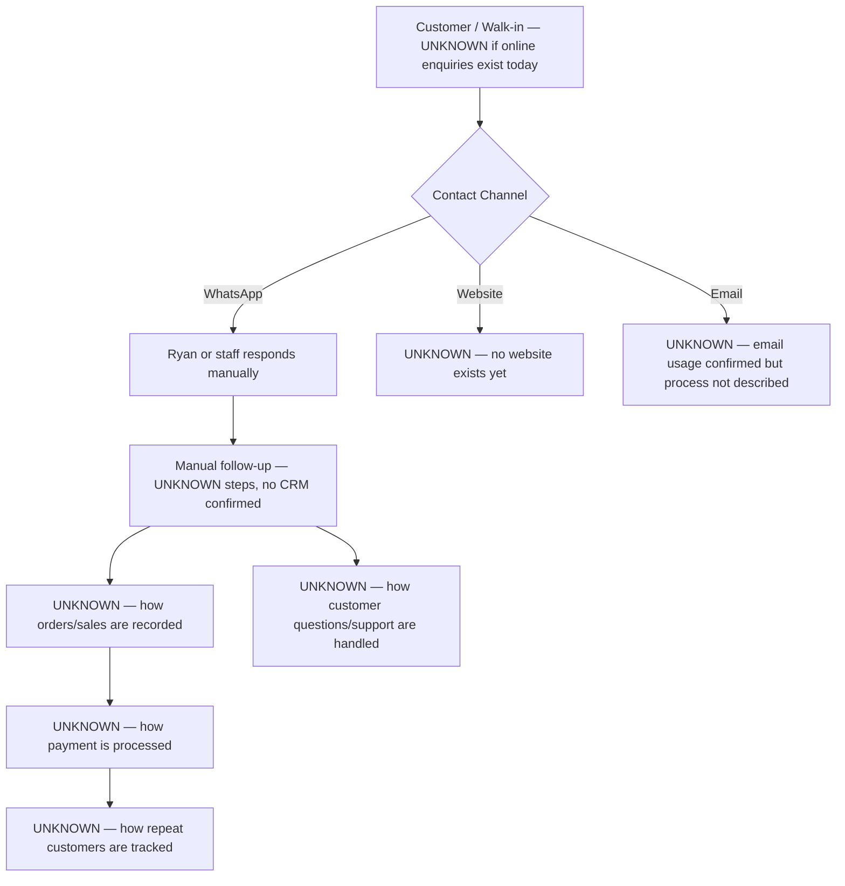

# Current state — Free & Easy Minimart

# Current State — Free & Easy Minimart

## Narrative
Free & Easy Minimart currently has no confirmed digital system in place. The customer (Ryan) has described an interest in a broad set of automations but has not yet described how the business actually operates day to day — no website exists yet, tools in use are unconfirmed, and the follow-up process is described only as 'manual.' Two lead sources are confirmed: website enquiries (once built) and WhatsApp. Most of the operational picture below is UNKNOWN and must be confirmed before any architecture can be finalised.

## What we know for certain
- No CRM or automation tool currently in use (client-provided: current_tools = empty)
- WhatsApp and email are both used, but process is undocumented
- Follow-up today is manual
- No accounting/ERP system named

## What is not yet known
- What the minimart actually sells and to whom (walk-in only vs. also delivery/bulk/B2B)
- Whether appointment booking and quotations apply to a specific part of the business (e.g., bulk orders, supplier visits) — unusual for a typical minimart
- Number of staff/locations
- How sales, payments and stock are currently handled
- Whether a website has ever existed
