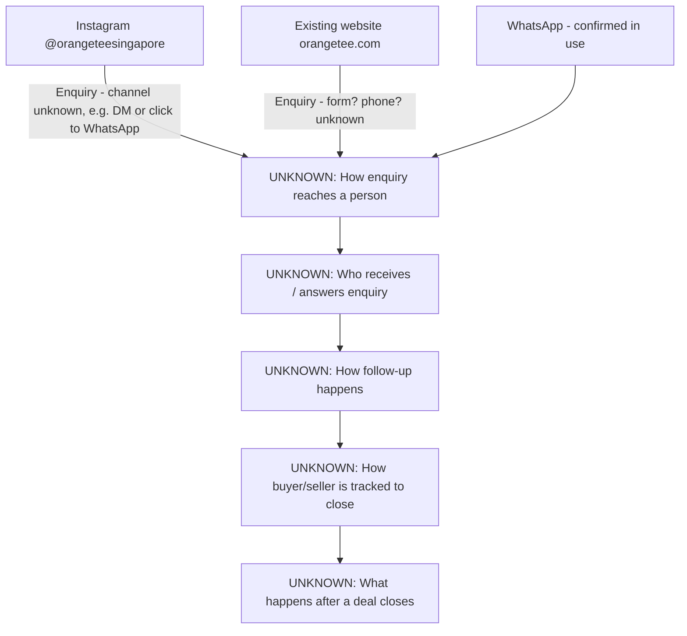

# Current state — OrangeTee

# Current State — OrangeTee

## What we know today
OrangeTee is a Singapore residential property agency handling **sales, rentals, and new launches**. They currently have:
- An existing website (orangetee.com)
- An Instagram presence (@orangeteesingapore)
- WhatsApp in use (confirmed by customer, details unknown)

We do **not yet know** how enquiries are actually handled once they come in — that part of the workflow is UNKNOWN and needs to be asked.

## Narrative
Today, OrangeTee attracts interest via Instagram and its existing website, and WhatsApp is part of their process in some way. Beyond that, we do not yet know:
- Whether the current website has any enquiry form, and where those enquiries go
- Who answers Instagram DMs or WhatsApp messages, and how fast
- Whether there is any agent assignment process (e.g., by property, by area, by lead source)
- Whether there is any CRM, spreadsheet, or system currently tracking buyer/seller leads
- What happens after a lead is qualified — viewing scheduling, offer process, documentation, closing

This is expected at this stage — the customer's immediate request was a **website mock-up**, not a full operations review. We can proceed with the mock-up now, while continuing to gather the missing operational facts in parallel.
