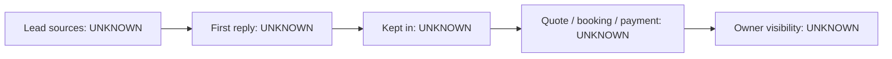

# Current state — Roen

## What we know (CLIENT-PROVIDED)
- Lead sources: UNKNOWN
- How enquiries are followed up: UNKNOWN
- Tools in use: UNKNOWN
- Accounting / ERP: UNKNOWN
- WhatsApp: used

Everything marked UNKNOWN is an open question for John (see 15_questions_open). Nothing here is inferred.
