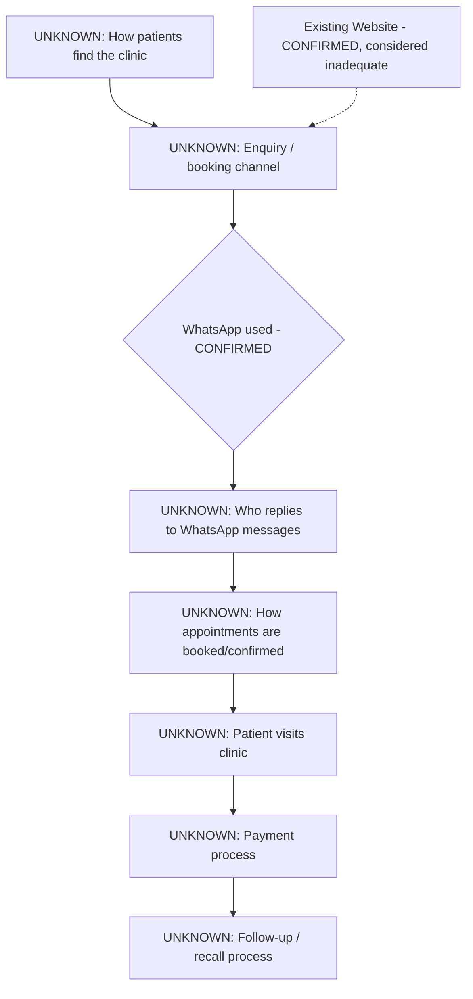

# Current state — Smile Plus Dental Surgery

# 01_current_state.md — Smile Plus Dental Surgery

## Narrative
We currently know very little about how Smile Plus Dental Surgery operates day to day. Ryan has confirmed the clinic name and that WhatsApp is used as a contact channel, and that an existing website exists but is considered inadequate. Everything else about how patients find the clinic, how enquiries/appointments are handled, and what happens after a patient contacts them is UNKNOWN at this stage.

## Current Workflow (as far as known)

## What we know for certain (CLIENT-PROVIDED)
- Clinic name: Smile Plus Dental Surgery
- Industry: dental clinic
- WhatsApp is used in some capacity
- An existing website exists, but Ryan is not satisfied with it

## What we do not yet know
- What the website's current problem actually is (design? bookings? mobile? speed? content? no online booking?)
- Whether the website currently generates enquiries and where those go
- Whether the clinic has any online appointment booking today
- Who manages WhatsApp replies (front desk, dentist, owner?)
- Whether there are other clinic locations or just one
- Whether there's an existing patient management / clinic software system
- How patients currently pay (cash, card, insurance, MediSave/Medisave-linked, corporate panels — common for SG dental clinics but NOT confirmed)
- What Ryan wants visitors to DO on the new website (call, WhatsApp, book online, ask about a service, see prices)
