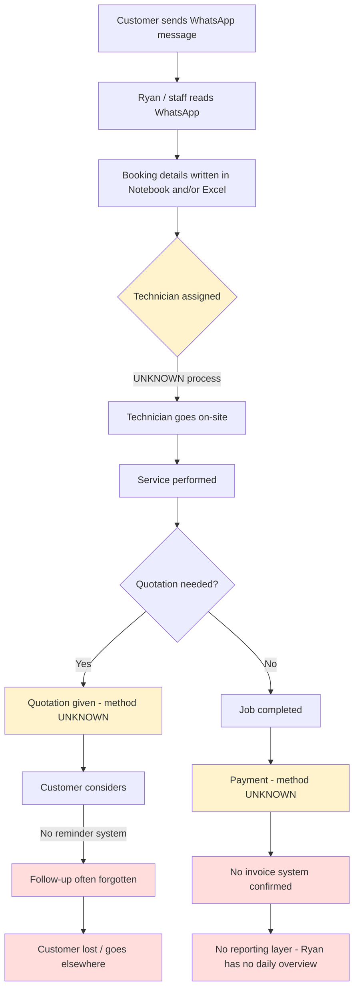

# Current state — Tan Aircon Services Pte Ltd

# 01_current_state.md — Tan Aircon Services Pte Ltd

## Narrative
Today, everything starts and ends in WhatsApp and paper/Excel. A customer messages Ryan's WhatsApp number to request an aircon servicing or repair booking. Ryan (or whoever picks up the chat) writes the booking details into a notebook and/or an Excel sheet. From there, a technician is assigned — but HOW that assignment happens (manually by Ryan? verbally? UNKNOWN) is not yet confirmed. Because there is no reminder system, technicians sometimes miss appointments. Similarly, when a quotation is given to a customer (process UNKNOWN — verbal, WhatsApp text, or written), there is no structured way to track whether the customer accepted, so follow-ups are frequently forgotten, and the business loses customers who would have converted. There is currently no visible invoicing, payment tracking or reporting layer — these are entirely manual or non-existent today.

## Current Workflow (Mermaid)

## Confirmed vs Unknown Steps
- CONFIRMED: WhatsApp is the only lead source; booking details are recorded in notebook + Excel; quotation follow-ups are frequently missed; 3 technicians; appointments sometimes missed.
- UNKNOWN: how technicians are assigned to jobs; how quotations are actually produced and sent; how payment is collected today; whether invoices are issued at all; whether recurring servicing/contracts exist; whether there's a service area limit.
